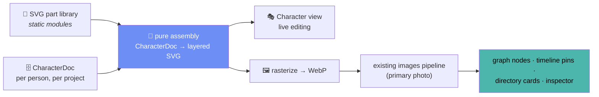

# Character View — proposal

An experimental sixth view: a **character creator**. Build a stylized 2D portrait for any
person from swappable SVG body parts — then use it everywhere the app already shows a face.

> **Status: proposal.** Nothing here is built. Experimental feature — gated behind
> **Advanced mode + 🧪 Labs**, exactly like the 3D Space layout (`caps.space3d`).

---

## TL;DR — the one-screen summary

**What:** a paper-doll editor. Pick a person → assemble hair / face / torso / arms / legs
from an SVG part library → recolor anything → resize any part → the result becomes the
person's portrait across the whole app (graph nodes, timeline pins, directory cards).

**How:** layered inline SVG (no new dependencies), a pure `CharacterDoc → SVG` assembly
function, one new `characters` table + two channels in `dbCore.ts` — works on desktop and
web automatically. Rasterized to WebP on save and pushed through the **existing image
pipeline** as the person's primary photo, so every view picks it up with zero new code.

```
┌────────────────────────────────────────────────────────────────────────┐
│ ≡ Project ▾   Character: Ellen Anderson ▾        Mode: Advanced ▾  🧪 ◐ │
├───┬────────────────────────────────────────────────┬───────────────────┤
│🕸 │  WARDROBE          STAGE                       │  INSPECTOR        │
│👥 │ ┌─────────┐          ___                       │ ┌───────────────┐ │
│🔗 │ │ 💇 Hair  │        /  ●  \      ✨             │ │ Hair: "Waves" │ │
│📅 │ │ 🙂 Face  │        \ ‿‿ /                     │ │ ██ ▓▓ ░░ 🎨   │ │
│◈  │ │ 👕 Torso │      ┌───┴───┐                    │ │ Size ──●────  │ │
│🎭 │ │ 💪 Arms  │     ╱│  ◆◆◆  │╲                   │ │ Tilt ────●──  │ │
│   │ │ 👖 Legs  │      │       │     ← character    │ ├───────────────┤ │
│＋ │ │ 👟 Feet  │      └──┬─┬──┘        breathes,   │ │ part grid:    │ │
│⚙  │ │ 🎩 Extra │        ─┘ └─          blinks      │ │ ▢ ▢ ▢ ▢ ▢ ▢  │ │
│   │ └─────────┘    ═══════════════                 │ │ ▢ ▢ ▢ ▢ ▢ ▢  │ │
│   │                 (soft podium glow)             │ └───────────────┘ │
│   ├────────────────────────────────────────────────┴───────────────────┤
│   │      ╭──── bottom pill: 🎲 Random · ⇄ Mirror · ↩ ↪ · 🖼 Set as ────╮ │
│   │      ╰──────────────── portrait · ⊕ − zoom ───────────────────────╯ │
└───┴─────────────────────────────────────────────────────────────────────┘
      icon rail gains a 6th item: 🎭 Character (only in Advanced + Labs)
```



**Why it's a good fit:** fictional/historical projects rarely have photos — this gives every
project a consistent, hand-crafted visual identity. And because characters are *data*, they
unlock family-resemblance features no photo ever could (see [Wild ideas](#wild-ideas)).

---

## 1. Concept & product fit

The app already serves fictional casts and historical figures ([design.md](./design.md) —
"not just real families"). Those projects have a photo problem: no photos exist, or they're
inconsistent scraps from wikis. The Character view turns the portrait from an *import
problem* into a *creative feature*:

- **Simple-first**: pick parts, pick colors, done — a decent portrait in under a minute.
- **Competent underneath**: per-part scaling, palette linking, layering, later genetics.
- **Non-destructive**: a character never replaces data; it's an alternative portrait a
  person can carry alongside real photos.

It also aligns with the roadmap's "bigger bets" spirit (time-lapse, reveal-info): the
character is one more lens on the same entities.

## 2. Gating — exactly like Space 3D

| Piece | Change |
|---|---|
| Capability | add `character: m === 'advanced' && labsEnabled.value` next to `space3d` in the `caps` computed (`store/index.js:161-185`) |
| Icon rail | add `{ id: 'character', icon: '🎭' }` to `IconRail.vue`, filtered through `caps` like the rest |
| Workspace | new layer in `App.vue`'s canvas-stack: `<CharacterView v-if="store.activeView === 'character'" />` (DOM/SVG view → `v-if` is fine; no GL context to preserve) |
| Degradation | if Labs turns off while active, fall back to `graph` — same pattern as space→free |
| i18n | `rail.character`, `character.*` keys in all three locale files |

No migration risk: with the flag off, the view, its channels' data, and its rail item are
simply invisible.

## 3. Data model & channels

One new top-level map in the DB, keyed by person (one character per person to start):

```typescript
// src/shared/types.ts
interface CharacterDoc {
  id: string
  project_id: string
  person_id: string
  version: 1                        // schema version for future migration
  parts: Record<SlotId, SlotState>  // only slots the user has touched
  palette: Record<PaletteChannel, string>  // skin | hair | eyes | outfitA | outfitB | accent
  morph: { height: number; build: number; headSize: number }  // -1..1 sliders
  created_at: string
  updated_at: string
}

type SlotId =
  | 'hair' | 'hairBack' | 'head' | 'eyes' | 'brows' | 'nose' | 'mouth'
  | 'ears' | 'facialHair' | 'torso' | 'arms' | 'hands' | 'legs' | 'feet'
  | 'headwear' | 'accessory' | 'held'

interface SlotState {
  partId: string | null       // null = slot intentionally empty
  colorRefs: string[]         // which palette channels this part's fills bind to
  scale: number               // 0.6..1.6, anchored at the part's socket
  offset?: { x: number; y: number }   // small manual nudge
  flip?: boolean
}
```

Channels in `src/shared/dbCore.ts` (project-scoped like everything else, `characters:save`
added to `WRITE_CHANNELS`):

- `characters:getByProject` — load all docs for the active project (one round-trip at load,
  same as persons/tags).
- `characters:save` — upsert by `person_id`; debounced autosave from the view, like
  `scenes:save`.
- Cascade: deleting a person also deletes its character doc (extend the existing
  person-delete cascade in `dbCore.ts` + `tests/db.test.js`).

The **portrait hand-off** reuses what exists: on "Set as portrait", rasterize the SVG to a
~512px WebP in the renderer (SVG → `Image` → canvas — same renderer-side approach as
`useThumbnail.js`; note `nativeImage` can't decode WebP, so this stays in the renderer) and
push it through `images:add` with `is_primary`, tagged e.g. `source: 'character'` so
re-saving replaces rather than accumulates. Graph atlas, timeline pins, directory cards all
update for free.

## 4. Rendering — layered SVG, pure assembly

**Why SVG (not WebGL) for this view:** it's a single character, not thousands of nodes.
Inline SVG gives free hit-testing, crisp vector zoom, CSS-variable recoloring, and trivial
export. Perf budget is ~200 DOM nodes — nothing. The WebGL machinery stays for the views
that need it; the *output* still feeds the WebGL avatar atlas as a bitmap.

**Part library** — static TypeScript modules, no asset loader:

```
src/renderer/src/components/character/
  parts/            hair.ts, faces.ts, torsos.ts, ...   (SVG path data + metadata)
  characterModel.ts  pure: doc + partLib → ordered layer list (testable, no Vue/DOM)
  characterGenes.ts  pure: blend two docs → child doc     (phase 2, testable)
  CharacterView.vue  the view: wardrobe rail, stage, inspector wiring
  CharacterStage.vue the live SVG assembly + idle animation
  PartGrid.vue       virtualized part thumbnails (reuse the Directory virtualization idiom)
```

Each part declares: `id`, `slot`, `paths` (with fill roles like `skin` / `hairMain` /
`outline`), a **socket** (anchor point + attach point, so parts snap and scale around the
right origin — hair scales from the scalp, arms from the shoulder), and a z-order band.
`characterModel.ts` resolves a `CharacterDoc` against the library into a flat, ordered
render list — a pure function unit-tested like `layoutAge`/`calendarMath`.

**Coloring:** parts never hard-code fills. Fills reference palette channels rendered as CSS
custom properties on the SVG root (`--ch-skin`, `--ch-hair`, …). Recoloring = changing one
style attribute; shading variants (outline, shadow tone) are derived in code by darkening
the channel color, so every part automatically looks coherent in any palette. This also
means the character respects **both themes** for UI chrome while its own colors stay
user-chosen.

**Enlargement/morphs:** per-slot `scale` applies a transform about the socket. The three
body morphs (height / build / head size) apply grouped transforms to leg/torso/head groups
— cartoon-proportions logic lives in `characterModel.ts`, also pure and testable.

**Motion (consistent with the app's motion language):** parts **spring in** when swapped
(~350–500ms, same easing family as layout changes); the character idles with a subtle
breathing loop and occasional blink (CSS animation — zero JS per frame); color changes
cross-fade. Nothing decorative beyond that — motion makes the state change legible, per
[design.md](./design.md).

## 5. UI design

Follows the established shell: stage in the canvas, controls in familiar containers, all
colors from tokens.

- **Wardrobe rail** (left edge of the canvas): a vertical glass strip of slot categories
  with emoji icons (💇 🙂 👕 💪 👖 👟 🎩), mirroring the icon-rail idiom. Selecting a slot
  highlights the matching region on the character with a soft `--accent` glow.
- **Stage** (center): the character on a subtle podium ellipse with an `--adim` spotlight
  wash. Click any body part directly to jump to its slot — the character *is* the menu.
  Scroll to zoom, drag to pan (bottom-pill ⊕/− like other views).
- **Inspector** (right dock, new dock tab content when this view is active): the selected
  slot's part grid (virtualized thumbnails, pre-rendered once to tiny canvases), palette
  swatches + a compact HSL picker, and the size/tilt sliders. Reuses `.btn`, `.badge`,
  dock resize — no new chrome vocabulary.
- **Bottom tool pill**: 🎲 Randomize (delightful first-touch — instant full character),
  ⇄ Mirror, ↩ ↪ undo/redo (an in-view command stack; autosave stays debounced),
  🖼 Set as portrait, and a person switcher.
- **Person picker**: the topbar scene-switcher slot becomes "Character: <name> ▾"; you can
  also drag a person in from the Directory dock tab, matching the spatial views' idiom.
- **Empty state**: a faceless silhouette with "Give <name> a face" + the Randomize die —
  progressive disclosure, Simple-mode-friendly even inside an Advanced feature.

## 6. Performance & platform notes

- One character in DOM SVG: negligible. Part grid virtualized + thumbnail-cached (the
  `useThumbnail.js` pattern) so 200+ parts scroll smoothly.
- Idle animation is pure CSS (`transform` on two groups) — 0% CPU beyond compositor,
  consistent with the on-demand-frame ethos of the WebGL views.
- Rasterization happens only on explicit save/portrait-set, in the renderer, works
  identically in the web build (data-URL images) — **web parity by construction**, since
  everything lives in renderer + `src/shared/`.
- Zero cost, zero deps: no new packages; part art is hand-authored path data committed to
  the repo.

## 7. Future: the 3D expansion path

Design the data so 3D is a *renderer swap*, not a remodel — the same trick the graph pulled
with Space:

- `CharacterDoc` stays renderer-agnostic: slots, palette channels, morphs. A future
  `Character3DStage.vue` maps the same doc onto a segmented low-poly mesh (Three.js is
  already a dependency; morphs → bone scales, palette → material colors).
- Keep `version` in the doc and never encode SVG specifics into stored data (store part
  *ids*, not paths) — 2D and 3D become two views of one document, switchable like layout
  types, maybe even a per-scene choice ("2D portrait scene" vs "3D turntable scene").
- Long-term: 3D characters as the node representation inside the Space 3D graph — your
  family constellation, populated by the characters you built.

## 8. Wild ideas {#wild-ideas}

Characters are structured data, so features photos could never do become one pure function
each. Roughly ordered by effort:

1. **🧬 Genetics.** "Inherit looks": generate a child's character by blending its parents'
   docs — dominant/recessive part picks, palette interpolation, a *family resemblance*
   slider (identical ↔ wildcard). One pure `characterGenes.ts` function; instantly the
   most magical button in the app. Corollary: **descendant preview** — pick any two people
   and peek at a hypothetical child.
2. **⏳ Aging with Time Travel.** The character responds to the Present date and the
   timeline scrub: child proportions before 12, grey creeping into the hair channel after
   60, posture morph, deceased persons rendering as a tasteful sepia ghost. Portraits in
   the timeline become *portraits at that moment in time*.
3. **📸 Portrait studio.** Pick a tag/group → auto-compose a "family photo": members lined
   up by generation on a backdrop, tallest at the back, export via the existing Export
   modal. Reunion posters for fictional houses.
4. **🎲 Gene-pool randomize.** Randomize doesn't roll uniform dice — it samples from the
   *project's* existing characters, so new faces automatically look like they belong to
   this world (Starks stay long-faced).
5. **🙂 Expressions & moods.** A small expression layer (happy/stern/smug/weary) selectable
   per portrait use — stern for the patriarch's graph node, warm in the inspector. Could
   even derive from data: lots of "divorced" edges → weary.
6. **🏷 Trait-driven wardrobe.** Derived accessories from data the app already has:
   occupation "blacksmith" suggests an apron, tag "House Lannister" auto-binds `outfitA`
   to the tag's color so groups are visually coherent across every view.
7. **👻 Resemblance overlay.** Ghost one relative's character over another's at 40%
   opacity to compare features — "she has her grandmother's eyes", literally.
8. **🧾 DNA share codes.** Serialize a doc to a compact base64 string ("character DNA") for
   copy/paste between projects — sharing without any server, honoring the zero-cost rule.
9. **🛡 Crest builder.** The same slot/palette engine with a heraldry part set gives tags
   emblem editing for free — group discs in the Groups view get proper sigils.
10. **🌦 Scene outfits.** Per-scene outfit overrides (winter reunion vs. court ball) — the
    doc stores a base, scenes store deltas, mirroring how scenes already store per-view
    state.

## 9. Phasing

| Phase | Scope | Proves |
|---|---|---|
| **1 — MVP** | view + gating + 7 core slots (hair/face/eyes/mouth/torso/legs/feet) + palette + per-part scale + autosave + Randomize + Set-as-portrait | the loop: build → save → see it everywhere |
| **2 — Depth** | full slot set, morph sliders, undo/redo, mirror, gene-pool randomize, genetics + descendant preview | characters as *data* |
| **3 — Time & stage** | aging/Time-Travel integration, expressions, portrait studio export | integration with the app's soul (time) |
| **4 — 3D Labs²** | `Character3DStage` over the same docs | the renderer-swap bet |

**Testing per convention:** `characterModel` / `characterGenes` / serialization get Vitest
coverage like the other pure math; `tests/db.test.js` gains character-cascade cases; the
view itself is verified manually in both themes and in `npm run dev:web`.

## 10. Open questions

- One character per person, or multiple "looks" per person (the aging feature may want
  explicit age variants rather than pure procedural aging)?
- Should Set-as-portrait be automatic on save, or stay an explicit action so real photos
  aren't clobbered? (Proposal assumes explicit.)
- Art direction of the part library: one consistent cartoon style is what makes blended
  families look related — worth locking a style guide (line weight, head ratio) before
  drawing many parts.
