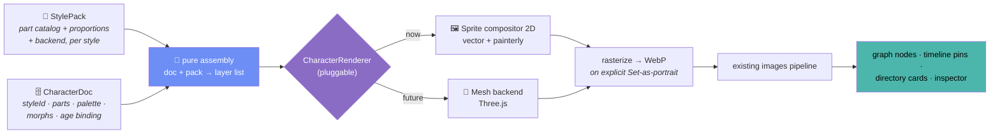

# Character View — proposal

An experimental sixth view: a **character creator**. Build stylized portraits for any person
from swappable body parts, in a **chosen art style** (anime, cartoon, Chinese painting,
realistic, renaissance…) — then use them everywhere the app already shows a face.

> **Status: Phase 1 (MVP) is built** — the view, gating, data layer, the 2D sprite
> compositor, the Cartoon style pack, multiple looks per person with age binding, and
> explicit Set-as-portrait all ship under `src/renderer/src/components/character/`.
> Phases 2–4 (genetics, more styles, timeline aging, 3D) remain proposals. Gated behind
> **Advanced mode + 🧪 Labs**, exactly like the 3D Space layout (`caps.space3d`).

---

## TL;DR — the one-screen summary

**What:** a paper-doll editor with **art styles**. Pick a person → pick a style → assemble
hair / face / torso / arms / legs from that style's part library → recolor and resize any
part → save it. A person can hold **several characters** (e.g. *Young Ellen*, *Old Ellen*),
each optionally bound to an age so the timeline shows the right face for the moment. Any one
can be **explicitly set** as the person's portrait, and then appears across the whole app.

**How:** a **renderer-agnostic `CharacterDoc`** (parts + palette + morphs + style, no pixels)
with **pluggable rendering backends** — the same seam pattern the graph and the API layer
already use. A 2D **layered-sprite compositor** draws today's styles (vector *and* painterly);
a Three.js **mesh backend** slots in later for 3D over the *same* document. On explicit
"Set as portrait" the result is rasterized to WebP and pushed through the **existing image
pipeline**, so graph nodes, timeline pins, and directory cards pick it up with zero new code.

```
┌────────────────────────────────────────────────────────────────────────┐
│ ≡ Project ▾   Character: Ellen ▾   Style: 🎴 Anime ▾   Mode: Advanced 🧪 │
├───┬────────────────────────────────────────────────┬───────────────────┤
│🕸 │  WARDROBE          STAGE                       │  INSPECTOR        │
│👥 │ ┌─────────┐          ___                       │ ┌───────────────┐ │
│🔗 │ │ 💇 Hair  │        /  ●  \      ✨             │ │ Hair: "Waves" │ │
│📅 │ │ 🙂 Face  │        \ ‿‿ /                     │ │ ██ ▓▓ ░░ 🎨   │ │
│◈  │ │ 👕 Torso │      ┌───┴───┐                    │ │ Size ──●────  │ │
│🎭 │ │ 💪 Arms  │     ╱│  ◆◆◆  │╲                   │ │ Tilt ────●──  │ │
│   │ │ 👖 Legs  │      │       │     ← breathes,    │ ├───────────────┤ │
│＋ │ │ 👟 Feet  │      └──┬─┬──┘        blinks       │ │ part grid:    │ │
│⚙  │ │ 🎩 Extra │        ─┘ └─                      │ │ ▢ ▢ ▢ ▢ ▢ ▢  │ │
│   │ └─────────┘    ═══════════════                 │ │ ▢ ▢ ▢ ▢ ▢ ▢  │ │
│   │  PORTRAITS ▸ [👶 Young] [🧑 Adult•] [👴 Old] + │ └───────────────┘ │
│   ├────────────────────────────────────────────────┴───────────────────┤
│   │   ╭── 🎲 Random · ⇄ Mirror · ↩ ↪ · 🖼 Set as portrait (explicit) ──╮ │
│   │   ╰──────────────────── ⊕ − zoom ─────────────────────────────────╯ │
└───┴─────────────────────────────────────────────────────────────────────┘
      icon rail gains a 6th item: 🎭 Character (only in Advanced + Labs)
      "PORTRAITS" filmstrip = the several characters this person owns (• = portrait)
```



**Why it's a good fit:** fictional/historical projects rarely have photos. This turns the
portrait from an *import problem* into a *creative feature*, gives every project a coherent
visual identity, and — because characters are *data, not pixels* — unlocks features no photo
ever could (family-resemblance genetics, aging on the timeline; see [Wild ideas](#wild-ideas)).

**The two ideas that make it fast *and* flexible:**
1. **Backend abstraction.** The document knows nothing about SVG/canvas/Three.js. Styles and
   dimensionality are renderer choices over one document — so "2D now, 3D later" and "5 art
   styles" are both just more backends/packs, not rewrites.
2. **Raster hand-off decouples fidelity from display cost.** Everywhere but the editor shows a
   pre-rendered WebP in the avatar atlas. A graph of 5,000 people costs the same whether
   portraits are stick figures or 3D oil paintings. See [§6](#6-performance).

---

## 1. Concept & product fit

The app already serves fictional casts and historical figures ([design.md](./design.md) —
"not just real families"). Those projects have a photo problem: none exist, or they're
inconsistent scraps from wikis. The Character view solves it creatively:

- **Simple-first**: pick a style, pick parts, done — a decent portrait in under a minute
  (🎲 Randomize gives a full one instantly).
- **Competent underneath**: multiple art styles, per-part scaling, palette linking, layering,
  multiple age-portraits per person, later genetics.
- **Non-destructive**: characters never replace data; they're portraits a person *carries*,
  alongside any real photos, and only feed the app's avatar when you explicitly say so.

## 2. Gating — exactly like Space 3D

| Piece | Change |
|---|---|
| Capability | add `character: m === 'advanced' && labsEnabled.value` next to `space3d` in the `caps` computed (`store/index.js:161-185`) |
| Icon rail | add `{ id: 'character', icon: '🎭' }` to `IconRail.vue`, filtered through `caps` like the rest |
| Workspace | new layer in `App.vue`'s canvas-stack: `<CharacterView v-if="store.activeView === 'character'" />` (its GL/canvas context is cheap to recreate, so `v-if` is fine) |
| Degradation | if Labs turns off while active, fall back to `graph` — same pattern as space→free |
| i18n | `rail.character`, `character.*` keys in all three locale files |

With the flag off, the view, its data, and its rail item are simply invisible. No migration
risk.

## 3. Data model & channels

A person owns **many** characters; each character targets **one style** and can be bound to an
age range so the timeline can pick it automatically.

```typescript
// src/shared/types.ts
interface CharacterDoc {
  id: string
  project_id: string
  person_id: string
  version: 1                         // schema version, for future migration
  label: string                      // "Young Ellen", "Coronation", …
  styleId: string                    // which StylePack this doc is authored in
  isPortrait: boolean                // explicitly chosen to feed the app avatar (≤1 per person)

  // Optional age/time binding → lets Timeline & Present pick the right face for a moment
  ageBinding: {
    fromAge: number | null           // inclusive lower bound (years)
    toAge: number | null             // inclusive upper bound
  } | null

  parts: Record<SlotId, SlotState>   // only slots the user has touched
  palette: Record<PaletteChannel, string>   // skin | hair | eyes | outfitA | outfitB | accent
  morph: { height: number; build: number; headSize: number }  // -1..1 sliders
  created_at: string
  updated_at: string
}

type SlotId =
  | 'hair' | 'hairBack' | 'head' | 'eyes' | 'brows' | 'nose' | 'mouth'
  | 'ears' | 'facialHair' | 'torso' | 'arms' | 'hands' | 'legs' | 'feet'
  | 'headwear' | 'accessory' | 'held'

interface SlotState {
  partId: string | null    // an id WITHIN the doc's StylePack; null = intentionally empty
  colorRefs: string[]      // which palette channels this part's fills bind to
  scale: number            // 0.6..1.6, anchored at the part's socket
  offset?: { x: number; y: number }
  flip?: boolean
}
```

Channels in `src/shared/dbCore.ts` (project-scoped like everything else; the writes added to
`WRITE_CHANNELS`):

- `characters:getByProject` — load all docs for the active project in one round-trip (like
  persons/tags).
- `characters:save` — upsert; debounced autosave from the view, like `scenes:save`.
- `characters:delete` — remove one doc.
- `characters:setPortrait` — flip `isPortrait` for one doc of a person, clearing it on the
  others (enforces ≤1 portrait per person server-side; explicit action, never automatic).
- Cascade: deleting a person deletes all its character docs (extend the existing person-delete
  cascade in `dbCore.ts` + `tests/db.test.js`).

**Portrait hand-off** reuses what exists: on explicit "Set as portrait", rasterize the active
backend's output to a ~512px WebP **in the renderer** (canvas → WebP — same renderer-side
approach as `useThumbnail.js`; note `nativeImage` can't decode WebP, so this must stay
renderer-side), then push it through `images:add` as `is_primary` with `source: 'character'`
so re-saving replaces rather than accumulates. Graph atlas, timeline pins, and directory cards
all update for free.

## 4. Rendering — a document, styles, and pluggable backends

This is the heart of the design and the answer to "SVG or Three.js?": **neither exclusively.**
The document is renderer-agnostic; *styles* and *dimensionality* are rendering choices over it.

```
CharacterDoc  ──(pure)──►  layer list  ──►  CharacterRenderer (interface)
  styleId,                 ordered,          ├─ SpriteCompositor2D   ← ships now
  parts, palette,          resolved          └─ MeshRenderer3D       ← future (Three.js)
  morphs, ageBinding       against the pack
```

```
src/renderer/src/components/character/
  styles/                 anime/ cartoon/ inkwash/ realistic/ renaissance/  (one StylePack each)
    <style>/parts/        part definitions + assets IN that style
    <style>/pack.ts       catalog, proportions, palette semantics, backend id
  characterModel.ts       PURE: doc + pack → ordered layer list (testable, no Vue/DOM)
  characterGenes.ts       PURE: blend two docs → child doc (phase 2, testable)
  render/
    CharacterRenderer.ts  the interface every backend implements
    SpriteCompositor2D.ts vector + painterly sprites → one composited frame
    MeshRenderer3D.ts     (future) Three.js mesh over the same doc
  CharacterView.vue       the view: wardrobe rail, stage, portraits filmstrip, inspector
  CharacterStage.vue      hosts the active backend + idle animation
  PartGrid.vue            virtualized part thumbnails (reuse the Directory virtualization idiom)
```

### Why a sprite compositor, not pure SVG

Your style list spans two families, and no single vector or single raster approach covers both:

| Style | Nature | Asset kind |
|---|---|---|
| 🎴 Anime, ✏️ Cartoon | flat vector | vector paths (rendered to sprites) |
| 🖌 Chinese painting (水墨), 🎨 Renaissance, 📷 Realistic | painterly / textured | raster sprites (WebP) |

Pure SVG can't render an ink wash or an oil-painting texture convincingly. A **layered-sprite
compositor** (canvas-2D for MVP; a thin WebGL quad layer if we want cheap tween/filter effects)
composites *both* vector-derived and painterly sprites through one code path — so adding a
style is adding an asset pack, not a renderer. (Vector styles can still author as SVG and be
rasterized to sprites at load; the *document* never stores pixels or paths, only part ids.)

### StylePack — what a style actually is

A `StylePack` makes the style choice reflect *everything*, per your ask:

- **Part catalog** — its own hair/face/clothing set in that style (an anime hoodie, a
  renaissance doublet, a hanfu). Choosing a part pulls from the *active* style's catalog.
- **Proportions & morph ranges** — anime = big head/eyes; realistic = natural ratios.
- **Palette semantics** — which channels exist and how shading is derived (ink wash uses tonal
  washes, not flat fills).
- **Backend id** — which `CharacterRenderer` draws it (all 2D styles → `SpriteCompositor2D`
  today; a style can later declare the 3D backend).
- **Socket geometry** — anchor + attach points per slot so parts snap and scale about the right
  origin (hair from the scalp, arms from the shoulder), tuned per style.

Switching a doc's style is a best-effort slot remap across packs (keep the slot, pick the
nearest part in the new pack) with a "start fresh" escape hatch — an [open question](#10-open-questions).

### Coloring, sizing, motion

- **Coloring**: parts never hard-code fills; they bind fills to palette channels. In 2D that's
  a per-sprite tint/multiply in the compositor (and CSS custom props for any vector chrome);
  shading tones are derived in code from the channel color so every part stays coherent in any
  palette and respects both app themes for surrounding UI.
- **Sizing/morphs**: per-slot `scale` transforms about the socket; three body morphs
  (height / build / head size) apply grouped transforms — the cartoon-proportions logic lives
  in `characterModel.ts`, pure and unit-tested like `layoutAge`/`calendarMath`.
- **Motion** (consistent with the app's language): parts **spring in** when swapped
  (~350–500ms, the app's easing family); a subtle breathing + occasional blink idle (driven by
  a `uTime`-style single animated value, no per-frame allocations — same ethos as the WebGL
  views); color changes cross-fade. Legible, not decorative.

## 5. UI design

Follows the established shell — stage in the canvas, controls in familiar containers, all
colors from tokens.

- **Style picker** (topbar, next to the person switcher): `Style: 🎴 Anime ▾`. Switching
  re-renders the current character in the new style.
- **Wardrobe rail** (left edge of the canvas): a vertical glass strip of slot categories with
  emoji icons (💇 🙂 👕 💪 👖 👟 🎩), mirroring the icon-rail idiom. Selecting a slot glows the
  matching region on the character.
- **Stage** (center): the character on a subtle podium ellipse with an `--adim` spotlight wash.
  Click any body part directly to jump to its slot — the character *is* the menu. Scroll to
  zoom, drag to pan.
- **Portraits filmstrip** (below the stage): the several characters this person owns
  (👶 Young · 🧑 Adult · 👴 Old …), a `+` to add one, and a badge marking which is the portrait.
- **Inspector** (right dock, this view's tab content): the selected slot's part grid
  (virtualized thumbnails pre-rendered once to tiny canvases), palette swatches + a compact HSL
  picker, and size/tilt sliders. Reuses `.btn`, `.badge`, dock resize — no new vocabulary.
- **Bottom tool pill**: 🎲 Randomize (delightful first-touch), ⇄ Mirror, ↩ ↪ undo/redo (an
  in-view command stack; autosave stays debounced), and **🖼 Set as portrait** — always an
  **explicit** action so real photos are never clobbered silently.
- **Person input**: the topbar shows "Character: <name> ▾"; you can also drag a person in from
  the Directory dock tab, matching the spatial views' idiom.
- **Empty state**: a faceless silhouette with "Give <name> a face" + the Randomize die —
  progressive disclosure even inside an Advanced feature.

## 6. Performance

The design keeps performance great by construction. Two regimes:

### 2D (what ships) — there are no polygons

- **Editing one character**: a single composited frame of ~15–20 layers. Trivial; recompose
  only on change, idle at 0% CPU (one animated value drives breathing/blink).
- **Everywhere else**: the atlas already consumes a **flat WebP bitmap**. So no matter the
  style — flat anime or a painterly renaissance sprite stack — the graph/timeline/cards cost is
  identical and unchanged from today. Fidelity is decoupled from display cost by the raster
  hand-off.
- **Part grids**: virtualized + thumbnail-cached (the `useThumbnail.js` pattern), so a catalog
  of hundreds of parts scrolls smoothly.
- **Web parity**: everything is renderer + `src/shared/`; rasterization uses canvas → WebP data
  URLs in the browser exactly as on desktop.

### 3D (the future backend) — where "lots of polygons" is the real question

Polygons only exist here, and only bite if you render *many live meshes at once* — which the
architecture never does:

| Context | Live meshes | Budget / strategy |
|---|---|---|
| Editor stage | 1 | up to ~100k tris is fine at 60fps; author target **8–15k** |
| Inspector / preview | 1–2 | same |
| **Population scale** (graph/timeline, thousands) | **0** | **impostor/atlas bitmaps — exactly today's cost** |

So a 3D character in the graph is still a pre-rendered sprite in the atlas; the live mesh
appears only on the editor stage (and optionally when a single node is zoomed fully in, via
**LOD**: mesh up close, impostor at graph scale). If you ever *do* want many live 3D characters,
the standard levers apply — **instanced meshes, a shared skeleton/material atlas, GPU skinning,
merged draw calls, aggressive LOD** — but the impostor rule means you almost never need them.
Bottom line: **the polygon count of a character never affects the views that draw thousands of
people, because those never draw the mesh.**

- **Zero cost, zero deps**: no new packages (Three.js is already present for the eventual 3D
  backend); 2D art is hand-authored assets committed to the repo.

## 7. The 3D expansion path

Because the document is renderer-agnostic, 3D is a *backend + pack*, not a remodel — the same
trick the graph pulled with Space:

- `CharacterDoc` already stores **part ids, palette channels, morphs** — never SVG paths or
  pixels — so a `MeshRenderer3D` maps the same doc onto a segmented low-poly mesh (morphs → bone
  scales, palette → material colors).
- A style declares its backend, so "3D anime" and "3D realistic" are just packs that point at
  `MeshRenderer3D`; 2D and 3D can even coexist as a per-scene choice ("2D portrait" vs "3D
  turntable").
- Long-term: 3D characters as node representations inside the Space 3D graph — your family
  constellation, populated by the characters you built (still impostor-atlased at population
  scale; live only for the focused node).

## 8. Wild ideas {#wild-ideas}

Characters are structured data, so features photos never could do become one pure function each.
Roughly ordered by effort:

1. **🧬 Genetics.** Generate a child's character by blending its parents' docs — dominant/
   recessive part picks, palette interpolation, a *family-resemblance* slider (identical ↔
   wildcard). One pure `characterGenes.ts`; instantly the most magical button in the app.
   Corollary: **descendant preview** — pick any two people and peek at a hypothetical child.
2. **⏳ Aging on the Timeline.** With multiple age-bound portraits per person, the timeline scrub
   and Present date pick the right face for the moment (and can cross-fade between the nearest
   two). Procedural touches — grey creeping into the hair channel, posture morph, a sepia-ghost
   for the deceased — layer on top.
3. **📸 Portrait studio.** Pick a tag/group → auto-compose a "family photo": members by
   generation on a backdrop, export via the existing Export modal. Reunion posters for fictional
   houses.
4. **🎲 Gene-pool randomize.** Randomize samples from the *project's* existing characters (in the
   active style), so new faces look like they belong to this world (Starks stay long-faced).
5. **🎨 Style crossfade.** Render the same person across styles — the same character as anime,
   ink wash, and renaissance side by side. Great for cover art and delightfully showy.
6. **🙂 Expressions & moods.** A small expression layer (happy/stern/smug/weary) per portrait
   use — stern on the patriarch's graph node, warm in the inspector; could even derive from data
   (many "divorced" edges → weary).
7. **🏷 Trait-driven wardrobe.** Derived accessories from data the app already has: occupation
   "blacksmith" → apron; tag "House Lannister" auto-binds `outfitA` to the tag's color so groups
   read coherently across every view.
8. **👻 Resemblance overlay.** Ghost one relative's character over another at 40% to compare
   features — "she has her grandmother's eyes", literally.
9. **🧾 DNA share codes.** Serialize a doc to a compact base64 "character DNA" string for
   copy/paste between projects — sharing with no server, honoring the zero-cost rule.
10. **🛡 Crest builder.** The same slot/palette engine with a heraldry pack gives tags emblem
    editing for free — group discs in the Groups view get proper sigils.

## 9. Phasing

Art assets — not code — are the real cost: **five fully-realized styles is a large art
undertaking.** The architecture supports N styles; ship them incrementally.

| Phase | Scope | Proves |
|---|---|---|
| **1 — MVP** | view + gating + backend interface + `SpriteCompositor2D` + **one** style (cartoon or anime, vector — cheapest, most forgiving) + 7 core slots + palette + per-part scale + autosave + Randomize + explicit Set-as-portrait | the loop: build → save → see it everywhere |
| **2 — Depth** | multiple portraits per person + age binding, morph sliders, undo/redo, mirror, gene-pool randomize, genetics + descendant preview | characters as *data* |
| **3 — Styles & time** | 2–3 more StylePacks incl. a painterly one (proves the compositor handles raster), aging on the Timeline, expressions, portrait-studio export | styles + integration with the app's soul (time) |
| **4 — 3D Labs²** | `MeshRenderer3D` over the same docs | the renderer-swap bet |

**Testing per convention:** `characterModel` / `characterGenes` / DNA serialization / style
slot-remapping get Vitest coverage like the other pure math; `tests/db.test.js` gains
character-cascade and portrait-uniqueness cases; the view is verified manually in both themes
and in `npm run dev:web`.

## 10. Open questions

- **Style switching semantics.** Best-effort slot remap across packs vs. "start fresh" — and do
  we keep the original doc when a user tries a different style, so switching is non-destructive?
- **Age binding vs. procedural aging.** Multiple explicit portraits is the primary mechanism
  (confirmed). How much procedural aging layers on top, and how the timeline chooses/interpolates
  when age ranges gap or overlap.
- **Art direction lock.** Each StylePack needs a style guide (line weight, head ratio, palette
  discipline) *before* drawing many parts — this is what makes blended families look related
  within a style. Which one style ships first in Phase 1?
- **Portrait vs. photos.** Set-as-portrait is explicit (confirmed). If a person has both a real
  photo and a character portrait, which wins in the atlas, and can the user pin their preference?
