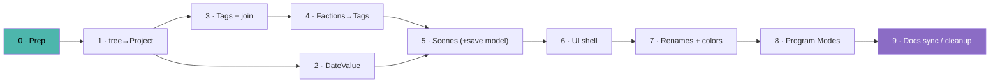

# Client overhaul — step-by-step build guide

*A "hand each step to Claude" playbook for implementing the client-side overhaul described in
[`client-structure.md`](./client-structure.md). Companion to that doc (the **what**) — this is
the **how**, in order. Written for vibecoding: paste one step's prompt into Claude, review, test,
commit, move on. Do not batch phases.*

> The design and every naming decision are locked in [`client-structure.md`](./client-structure.md)
> and [`data-model.md`](./data-model.md#target-model-in-progress). If a step is ambiguous, those
> docs win — tell Claude to consult them.

---

## How to use this guide

- Each **Phase** is one shippable slice. Do them **in order** — later phases depend on earlier
  ones. Commit at the end of each phase (branch off `master`; the work is on `refactor-threejs`).
- Every step is a 🤖 **CLAUDE** coding task (no accounts/keys needed). The grey-ish quote block is
  the prompt to paste.
- After every step, run the **Definition of Done** checks. Don't move on if any fails.

### Definition of Done (run after every step)

```bash
npm run typecheck   # tsc --noEmit — no new errors
npm test            # Vitest data-layer suite — green
npm run lint        # ESLint — clean
npm run dev         # desktop: the thing you changed works, both dark & light themes
npm run dev:web     # WEB PARITY: same behaviour in the browser (IndexedDB backend)
```

> **The two rules that keep this safe** (from [CLAUDE.md](../CLAUDE.md) / [conventions.md](./conventions.md)):
> 1. **Never skip the data-access chain** — new data ops go in `src/shared/dbCore.ts`
>    (`channelHandlers`), then a store action, then components. Components never call `api.invoke`
>    directly (image lists are the only legacy exception).
> 2. **Web parity is mandatory** — every data change flows through the shared core, so desktop
>    (JSON file) and web (IndexedDB) stay identical. Check `dev:web` every phase.

### Phase dependency map



Each phase keeps the app fully working. Phases 1–5 are data/logic (covered by
`tests/db.test.js` — **extend it as you go**). 6–7 are presentation. 8–9 are additive + cleanup.

---

## Phase 0 · Prep & baseline

**Goal:** clean starting point; everyone (you + Claude) shares the plan.

> Read `docs/client-structure.md`, `docs/data-model.md` (Target model section), and
> `docs/graph.md`. Confirm the current test suite is green (`npm test`) and the app runs on both
> `npm run dev` and `npm run dev:web`. Summarize back to me, in 10 bullet points, the exact
> rename map (old → new) and the target data-model changes you're about to implement, so we agree
> before touching code. Don't change any code yet.

**Check:** baseline tests green on both targets; Claude's summary matches
[`client-structure.md` §10 glossary](./client-structure.md#10-glossary).

---

## Phase 1 · Rename tree → **Project** (mechanical, no behavior change)

**Goal:** rename the container everywhere with zero behaviour change. Pure find-and-rename +
a one-time data migration. Ship this alone so any regression is obviously "the rename."

**Touches:** `src/shared/dbCore.ts`, `src/shared/types.ts`, `src/main/db.js`, `src/main/ipc.js`,
`src/renderer/src/store/index.js`, `src/renderer/src/api/backends/*`, most components,
`tests/db.test.js`.

> Rename the "tree" concept to "project" across the whole app, with **no behaviour change**:
> - Channels `trees:*` → `projects:*`; field `tree_id` → `project_id`; collection `trees` →
>   `projects`; `activeTreeId` → `activeProjectId`; store `trees`/`activeTree`/`switchTree`/… →
>   `projects`/`activeProject`/`switchProject`/…; UI strings "tree/family tree" → "project" where
>   they mean the container (keep the word "graph" for the visualization — that comes later).
> - Add an idempotent migration in `initDB()` (and the web backend's init): if a file has `trees`
>   /`tree_id`/`activeTreeId`, rename in place. Keep reading old files.
> - Update `tests/db.test.js` to the new names and add a test that an old (`trees`) file migrates.
> Follow the data-access chain; keep desktop and web identical. Run the full Definition-of-Done.

**Check:** app behaves exactly as before on both targets; old-file migration test passes.

---

## Phase 2 · Structured dates (**DateValue**)

**Goal:** store dates as a mutable structured object (future-proof for custom calendars) while the
UI still only edits a Gregorian year for now.

**Touches:** `src/shared/types.ts` (add `DateValue`), `dbCore.ts` (seed + migration), a new
`src/shared/calendarMath.ts`, `PersonForm.vue`, layout math that reads years (`layoutAge.js`,
`components/timeline/timelineLayout.js`), `tests/`.

> Introduce a `DateValue` type `{ year:number|null, month:number|null, day:number|null,
> precision:'year'|'month'|'day', calendar:'gregorian' }`. Migrate `person.birth_year`/
> `death_year` and `relationship.formed_date` (numbers|null) into `birth`/`death`/`formed`
> DateValues (`{year, month:null, day:null, precision:'year', calendar:'gregorian'}`; null stays
> null). Add `src/shared/calendarMath.ts` with pure `toOrdinal(date, calendar)`,
> `format(date, calendar)`, `duration(a,b,calendar)` (Gregorian only for now — a year maps to
> `year`). Point the Birth/age layout and Timeline spacing at `toOrdinal` instead of raw years.
> Keep `PersonForm` editing just the year (writing a year-precision DateValue). Add migration +
> round-trip tests. Full Definition-of-Done, both targets, both themes.

**Check:** Timeline + Birth layout look identical; a year-only person still renders; tests cover
the number→DateValue migration.

---

## Phase 3 · **Tags** + `entity_tags` join + indexes

**Goal:** first-class tags with many-to-many membership and O(1) lookups both ways. No UI cluster
view yet — just data + basic assign/unassign in the person editor.

**Touches:** `types.ts`, `dbCore.ts` (new `tags` + `entity_tags` handlers + `WRITE_CHANNELS`),
store (actions + `tagsOf`/`membersOf` computed indexes), `PersonForm.vue`/`PersonModal.vue` (a
simple tag chips editor), `tests/`.

> Add a `Tag` entity `{id, project_id, label, type, source:'manual'|'derived', color, icon}` and a
> join collection `entity_tags {id, entity_id, tag_id}`. Add channels `tags:getAll|create|update|
> delete` and `entity_tags:add|remove` in `dbCore.ts` (register in `ipc.js`, add writes to
> `WRITE_CHANNELS`), plus store actions. In the store, expose two computed index Maps built once
> from `entity_tags`: `tagsOf[entityId]` and `membersOf[tagId]` — O(1) both directions. Deleting an
> entity or a tag must clean up its `entity_tags` rows (extend the cascade + tests). Add a minimal
> tag-chips editor to the person modal/form (add/remove manual tags, pick colour). Keep derived
> tags out for now. Full Definition-of-Done on both targets.

**Check:** create a tag, assign 2 people, delete one person → its join rows vanish; web parity;
tests cover the join cascade.

---

## Phase 4 · Factions → **Tags** + `scene_tags` (Groups on tags)

**Goal:** dissolve factions. A group becomes "a tag placed in a Groups scene," and membership moves
to the global tag join. This phase touches **real saved data**, so it's split into 4 sub-steps —
**commit each one** so a regression is easy to bisect.

> **On the Phase 4 ↔ 5 split (read first).** A `scene_tag` placement must belong to a *scene*, so
> the `scenes` container has to exist before the faction migration. Therefore **Phase 4 introduces
> the scenes container and migrates `scenarios` → `groups` scenes** (steps 4.1–4.2), because
> factions depend on it. **Phase 5 then generalizes scenes** to the Graph/Timeline views (layout
> `type`, tab strip) and adds the **save model**. Don't build graph scenes or the save model here.

### Step 4.1 — Scenes container (skeleton) + migrate scenarios → groups scenes
*Goal:* a minimal `scenes` collection so placements have a home; move scenarios into it 1:1.
*Touches:* `types.ts`, `dbCore.ts` (`scenes` + handlers + `WRITE_CHANNELS`), store, `tests/`.

> Add a `Scene {id, project_id, view, name, type?, config, positions}` collection and channels
> `scenes:getAll|create` (view-scoped). Migrate each existing `scenario` → a `scene` with
> `view:'groups'` (same id is fine — keep a stable mapping from old `scenario_id` to the new scene
> id so step 4.3 can point placements at it). Replace the store's `scenarios`/`activeScenarioId`
> with `scenes` filtered by view + `activeSceneId` **for the groups view only** for now; keep the
> Groups view working exactly as before (it still reads factions this step). Idempotent migration +
> tests. Full Definition-of-Done. **Commit.**

*Check:* scenarios now load as groups scenes; Groups view unchanged; old file migrates.

### Step 4.2 — `scene_tags` placement collection + handlers
*Goal:* the placement record that will replace faction position/visibility.
*Touches:* `types.ts`, `dbCore.ts` (`scene_tags` + `scene_tags:add|move|setVisible|remove` +
`WRITE_CHANNELS`), store, `tests/`.

> Add `scene_tags {id, scene_id, tag_id, x, y, visible}` with handlers to add/move/hide/remove a
> placement, plus store actions. No UI wiring yet and no migration yet — just the data ops + a unit
> test that a placement round-trips and is cascade-deleted when its scene or tag is deleted. Full
> Definition-of-Done. **Commit.**

*Check:* placements round-trip and cascade; nothing else changes.

### Step 4.3 — The migration: factions → tags + entity_tags + scene_tags
*Goal:* convert all faction data losslessly. This is the delicate step — spell out the rules.
*Touches:* `dbCore.ts`/`db.js` migration, `tests/db.test.js`.

> Add a one-time, idempotent migration: for the project's factions, **dedupe by name** into `Tag`
> records (same-named factions across scenarios collapse to ONE tag; carry colour/icon from the
> first occurrence). For each faction, add `entity_tags` rows for its `member_ids` (skip duplicates
> so a person shared across scenarios has exactly ONE join row per tag). For each faction, add one
> `scene_tag` pointing at the groups scene migrated from that faction's `scenario_id` (step 4.1
> mapping), copying `x/y/visible`. Do **not** delete the old `factions` collection yet (step 4.4
> removes it) — write the new data alongside so the step is reversible. Tests: an old
> factions/scenarios file migrates; a person in the "same" tag across two scenarios yields one tag +
> one join row + two placements; re-running the migration is a no-op. Full Definition-of-Done.
> **Commit.**

*Check:* run the migration on a real old file and on the seed; counts match (tags = distinct
faction names; join rows = distinct person-tag pairs; placements = faction count).

### Step 4.4 — Rewire the Groups view to tags/placements; remove faction code
*Goal:* the view reads the new model; dead faction code goes.
*Touches:* `FactionsView.vue` + its renderer/layout, store, `dbCore.ts` (delete faction handlers),
`tests/`.

> Point the Groups view at the new model: members via `membersOf[tagId]`, positions/visibility via
> `scene_tags`, scenario switching via `activeSceneId` (groups). Drag-to-group edits `entity_tags`;
> move/hide edits `scene_tags`; create/rename/recolor a group edits the `Tag`. Then delete the
> `factions:*` handlers, the `factions` collection, and `member_ids`/`scenario_id` faction fields,
> and remove now-dead store state. Behaviour must match today (same clustering, drag, hide, scenario
> switch). Update tests to drop faction references. Full Definition-of-Done. **Commit.**

*Check:* Groups view drag/hide/scenario-switch identical to before on both targets; no `faction`
references remain in the codebase (grep).

---

## Phase 5 · **Scenes** for Graph/Timeline + the save model

**Goal:** generalize the Phase-4 scenes container to the Graph (and Timeline) views — the layout
**type** becomes a scene property (flattened) — then add autosave + manual checkpoint. Also split
into sub-steps that **each commit** (5.2 and 5.4 migrate/replace live behaviour).

> Prereq: Phase 4 already created the `scenes` collection and the `groups` scenes. This phase adds
> `graph` (and a default `timeline`) scenes and the full scene CRUD + save model.

### Step 5.1 — Generalize scene CRUD + the shared Scene tab strip
*Goal:* full lifecycle + one reusable tab UI for every spatial view.
*Touches:* `dbCore.ts` (`scenes:rename|duplicate|delete|save`), store, a new shared
`SceneTabs.vue`, `tests/`.

> Extend scene channels with `rename`, `duplicate` (deep-copy `config`/`positions`/`scene_tags`),
> `delete`, and `save` (persist `config`/`positions`). Add a reusable **Scene tab strip** component
> that lists the *active view's* scenes, marks the active one, and offers new/rename/duplicate/
> delete — and drop it into the Groups view first (replacing its scenario bar) with identical
> behaviour. Tests for duplicate/delete cascade. Full Definition-of-Done. **Commit.**

*Check:* Groups scene tabs do everything the old scenario bar did; duplicate copies placements.

### Step 5.2 — Migrate `graphState` → graph scenes (flatten mode → type)
*Goal:* the risky graph migration; existing arrangements must survive byte-for-byte in behaviour.
*Touches:* `dbCore.ts`/`db.js` migration, `tests/db.test.js`.

> Add an idempotent migration that unpacks each project's serialized `graphState` setting into
> `view:'graph'` scenes: every saved per-mode "state" becomes a scene whose **`type`** is its former
> mode (Custom→`free`, Auto→`organic`, Age→`birth`, Generation→`generations`), carrying that state's
> node `positions` and any generation-row config into `scene.config`. Preserve the previously-active
> mode+state as the active graph scene. Keep the old `graphState` value until Step 5.3 is verified
> (don't delete it in this step). Tests: a real `graphState` blob expands to the right scenes with
> the right types/positions; re-running is a no-op. Full Definition-of-Done. **Commit.**

*Check:* scene count = sum of saved states across modes; each scene's `type` and positions match the
old snapshot; active scene = the old active mode/state.

### Step 5.3 — Wire GraphCanvas (+ Timeline) to scenes
*Goal:* the Graph view runs off scenes; the type picker sets `activeScene.type`.
*Touches:* `GraphCanvas.vue` (states→scenes, `enter*Mode`→`type`), Timeline (a single default
scene), `SceneTabs` in both, store, remove old `graphState` read/write path.

> Replace GraphCanvas's per-mode states with scenes: the layout **type** picker sets
> `activeScene.type` and re-runs the same layout math; the Scene tab strip drives scene switching
> with the **same snapshot-then-animate** transition. Give Timeline a single default scene now
> (manual positions come later). Remove the old `graphState` serialization once scenes are the
> source of truth. **Behaviour must match today** — same four layouts, same animations, same restore
> on load. Full Definition-of-Done. **Commit.**

*Check:* every old layout/animation is reproduced; saved arrangements restore identically; web
parity.

### Step 5.4 — Save model: autosave + checkpoint + revert + exit prompt
*Goal:* replace `graphDirty`/"Save Layout" with autosave + a manual checkpoint you can revert to.
*Touches:* store (working-vs-checkpoint state, `saveCheckpoint`/`revertToCheckpoint`), `App.vue`,
`src/main/index.js` close dialog, web `beforeunload`, Project ▾ menu, `tests/`.

> Everything already autosaves through the data-access chain; formalize it: keep a **saved
> checkpoint** distinct from the live working copy, add `saveCheckpoint()` (⌘S / Project ▾ → Save)
> and `revertToCheckpoint()` (Project ▾ → Revert to saved), and a `hasUnsavedChanges` comparison.
> Remove `graphDirty` and the on-canvas Save Layout button/pulse. Wire the exit dialog — Electron
> main-process close **and** the web `beforeunload` — to prompt **Save / Discard / Cancel** when the
> working copy differs from the checkpoint. Tests for checkpoint/revert. Full Definition-of-Done.
> **Commit.**

*Check:* edits autosave (survive reload); Save then edit then Revert restores the checkpoint; exit
with unsaved changes prompts on both targets.

---

## Phase 6 · UI shell: icon rail · tool pill · right dock · ⌘K

**Goal:** the new frame from [`client-structure.md` §7](./client-structure.md#7-the-shell-screen-layout).
No new data — this is layout/UX. Keep every existing function reachable.

**Touches:** `App.vue`, `LeftSidebar.vue` → icon rail, new `RightDock` (Inspector + Directory
tabs), a bottom **tool pill** + **Scene tab strip** in the spatial views, a `Project ▾` menu, a
`CommandPalette` (⌘K).

> Restructure the shell into three fixed zones: (1) a slim **left icon rail** with the 5 views +
> add + settings (replace the left-sidebar nav list); (2) the **canvas** with a single **bottom
> tool pill** (Type picker + zoom + Focus popover + Legend toggle — consolidate today's scattered
> graph controls) and the **Scene tab strip**; (3) a tabbed, collapsible **right dock** with an
> **Inspector** tab (selected entity details + quick edit — replaces the always-on people list) and
> a **Directory** tab (the searchable, draggable roster — reuse the People/Directory list
> component). Dragging an entity from the Directory tab onto the canvas **places** it in the active
> scene (Phase 5 positions). Move stats + Export/Import + **Save**/**Revert** into a **Project ▾**
> menu in the top bar; add a **⌘K command palette** to jump to any entity. Nothing may become
> unreachable. Verify on both targets, both themes; check it degrades gracefully at narrow widths
> (mobile/PWA-friendly). Full Definition-of-Done.

**Check:** every pre-overhaul action is still reachable; right dock collapses; drag-to-place works
in Graph/Timeline/Groups; ⌘K jumps; web parity.

---

## Phase 7 · Terminology, view renames & colors

**Goal:** apply the user-facing names and the color fix. Mostly labels + `activeView` ids.

**Touches:** `store` (`activeView` values), all views/components (labels), styling tokens.

> Apply the renames end to end: view ids/labels **Tree→Graph** (`activeView:'graph'`), **All
> People→Directory** (`'directory'`), **Factions→Groups** (`'groups'`); layout **types** Custom→
> **Free**, Auto→**Organic**, Age→**Birth**, Generation→**Generations**; panels **Highlights→
> Focus**, **Graph Settings→Style**, **Clean Tree→Clean View**; **Current Date→Present**. Update
> the design tokens so **spouse links are gold** (not pink) — relationships encode via line style +
> their own hue set so colour never collides with gender (female stays magenta). Keep both themes
> correct. This is cosmetic/string-level — no data or logic change. Full Definition-of-Done.

**Check:** the whole UI reads in the new vocabulary; spouse/female colours no longer clash; both
themes fine.

---

## Phase 8 · **Program Modes** (Simple / Standard / Advanced)

**Goal:** app-wide feature tiers via progressive disclosure. Optional: per-project entity noun.

**Touches:** `globalSettings.programMode` (default `'standard'`), a Mode picker in the top bar, and
`v-if`/capability guards across the UI.

> Add a global `programMode` setting: **Simple / Standard / Advanced** (default Standard), with a
> picker in the top bar. Gate features by mode via progressive disclosure per the table in
> [`client-structure.md` §6.1](./client-structure.md#61-program-modes-app-wide-feature-tiers--not-the-graph-layout-types):
> Simple = Graph + Directory only, one auto scene, Organic type only, no Focus/Style/tags;
> Standard = all views, scenes, Focus + basic Style, manual tags; Advanced = everything (all Style
> + physics sliders, custom-calendar hook, custom entity noun). Implement as capability flags the
> components read — no duplicated screens. (Optional, Advanced only: a per-project `entity_noun`,
> default "Person", that relabels node/buttons — display only, data stays `persons`.) Full
> Definition-of-Done; verify each mode shows the right subset on both targets.

**Check:** switching mode shows/hides the right features; nothing errors when a feature is hidden;
web parity.

---

## Phase 9 · Docs sync & cleanup

**Goal:** make the docs match the shipped code; remove the "target design" banners; retire scaffolding.

> Now that the overhaul is implemented, update the docs to describe it as **current** (not target):
> remove the 📐 banners from `client-structure.md`, `data-model.md`, `graph.md`; fold the "Target
> model" into the main body of `data-model.md` and delete the "Current model" section; sweep
> `architecture.md`, `ipc-api.md`, `developer.md`, `conventions.md`, and the root `README.md` for
> stale terms (tree/faction/scenario/state/mode → project/tag/group/scene/type) and updated channel
> names. Update `tests/` names to match. Confirm `docs/` internal links resolve. Full
> Definition-of-Done.

**Then, optional follow-ups (separate PRs):**
- **Derived (smart) tags** — computed from occupation/location/birth-decade; a store getter, not
  stored ([client-structure.md §5.1](./client-structure.md#51-tags--a-many-to-many-join)).
- **Custom calendars** — the Advanced-mode editor over `calendarMath` (design.md future feature).
- **Timeline scenes** — manual entity positions + saved scenes in the Timeline view.

**Check:** grep the docs for `tree_id`, `faction`, `scenario`, `activeView.*tree` — no stale
references remain; all docs read in the new vocabulary.

---

## Quick reference — the rename map

| Old | New |
|-----|-----|
| tree / `tree_id` / `trees:*` | **project** / `project_id` / `projects:*` |
| Tree view (`activeView:'tree'`) | **Graph** (`'graph'`) |
| All People view | **Directory** (`'directory'`) |
| Factions view | **Groups** (`'groups'`) |
| faction + `member_ids` | **tag** + `entity_tags` join |
| faction placement | **`scene_tags`** row (a **Group**) |
| scenario + state | **Scene** (`scenes`, per view) |
| mode (Custom/Auto/Age/Gen) | scene **type** (Free/Organic/Birth/Generations) |
| Highlights / Graph Settings / Clean Tree | **Focus** / **Style** / **Clean View** |
| Current Date | **Present** |
| `birth_year`/`death_year`/`formed_date` numbers | **`DateValue`** (`birth`/`death`/`formed`) |
| Save Layout + `graphDirty` | autosave + **Save**/**Revert** checkpoint |
| *(none)* | **Program Mode** (Simple/Standard/Advanced) |

See [`client-structure.md`](./client-structure.md) for the full mental model and
[`data-model.md`](./data-model.md#target-model-in-progress) for exact shapes.
