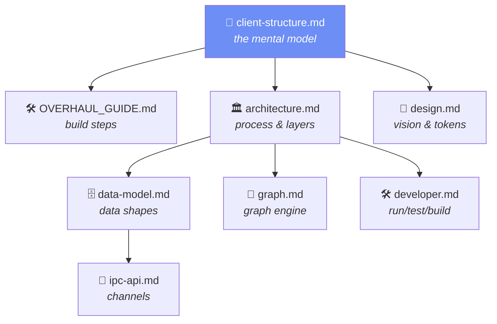

# FamilyTree documentation

Developer and design documentation for the FamilyTree desktop app. If you're new
here, read them roughly in this order:

| Doc | What it covers |
|-----|----------------|
| [client-structure.md](./client-structure.md) | **Visual guide** to projects, views, layout types, scenes, tags/groups & state (the target design). Read this first for the mental model. |
| [OVERHAUL_GUIDE.md](./OVERHAUL_GUIDE.md) | Step-by-step build plan for the client overhaul — hand each step to Claude. |
| [architecture.md](./architecture.md) | Process model, layers, data flow, module map. |
| [data-model.md](./data-model.md) | The JSON store shape, entities, IDs, migrations. |
| [ipc-api.md](./ipc-api.md) | Every IPC channel, the request/response envelope, and the preload bridge. |
| [graph.md](./graph.md) | The graph engine — layout modes, saved states, guides, highlights, persistence. |
| [conventions.md](./conventions.md) | Coding conventions and the patterns to follow. |
| [developer.md](./developer.md) | Setup, scripts, project layout, testing, build internals. |
| [contributing.md](./contributing.md) | Branch/PR workflow and the definition of done. |
| [design.md](./design.md) | Product vision, UX principles, the visual design system, roadmap. |

### How the docs fit together

For a user-facing overview and quick start, see the [project README](../README.md).
