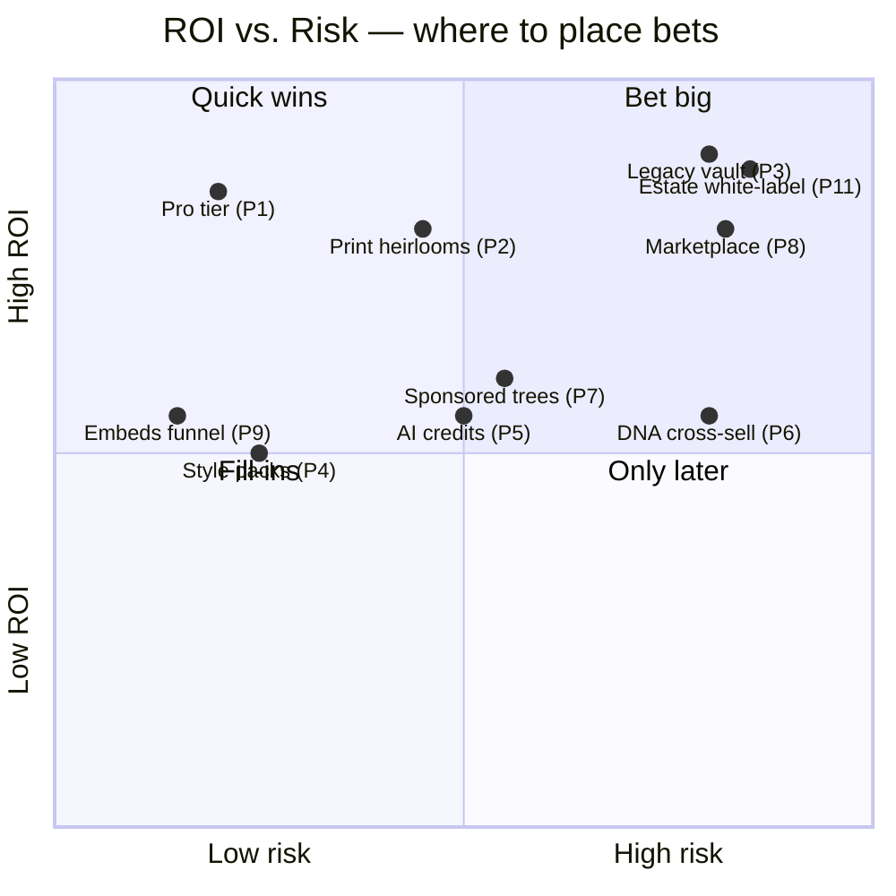

# Wild ideas & the idea backlog

*A blue-sky brainstorm for FamilyTree — the place for "wouldn't it be cool if…". Half of
this is impractical, some of it is a signature feature waiting to happen, and a few are
things **no one has built before**. Nothing here is a commitment; it's raw material.*

*Companion to the grounded roadmaps in [`design.md`](./design.md#roadmap),
[`MID_DEVELOPMENT.md`](./MID_DEVELOPMENT.md) §8–9, the character-specific
[`CHARACTER_VIEW_PROPOSAL.md`](./CHARACTER_VIEW_PROPOSAL.md#wild-ideas), and the aspirational
[`designDraft.txt`](../designDraft.txt). Read those for what's already planned; read **this**
for what's over the horizon.*

---

## How to read this

Every new idea is tagged so you can scan by appetite:

| Tag | Meaning |
|-----|---------|
| 🎯 **Practical** | Real user value, would earn its keep |
| 😎 **Cool** | Mostly delight / shareability / "whoa" |
| 🧪 **Experimental** | Nobody's obviously done this; risk *is* the point |
| 🚀 **Moonshot** | Big, probably later, changes what the app *is* |
| 🏗️ **Leans on** | The existing system it reuses (so it's cheaper than it looks) |
| 💸 | Note on the zero-cost constraint (no paid services, no card-required tiers) |
| Effort | **S** hours–day · **M** days · **L** weeks+ |

The guiding lens: **this app already owns a fast WebGL graph engine, a d3-force
simulation, a kinship graph, a pure-layout-math architecture, structured `DateValue`
dates, tags/scenes, and a renderer-agnostic `CharacterDoc`.** The best new ideas are the
ones that fall out of things we *already have* — a new pure function, a new layout type, a
new lens over the same data. Those are marked with 🏗️.

---

## Part 1 — Status snapshot (so we don't reinvent)

A one-glance map of what's **already captured** elsewhere, so Part 2 can stay genuinely new.
Full detail lives in the linked docs.

### ✅ Already shipped (in code)
Five views (Graph WebGL · Timeline WebGL · Groups WebGL · Directory · Relationships) ·
Projects · Program Modes (Simple/Standard/Advanced) · Scenes + layout types + autosave/
checkpoint · Tags over a membership join · Accounts/auth · **3D Space** graph (Labs) ·
**Character View Phase 1** (paper-doll portraits, Cartoon pack, age binding, set-as-portrait) ·
web build (IndexedDB) · CI + TS adoption started.

### 📋 Already planned / documented (don't duplicate — extend instead)
- **Platform:** Supabase backend, cloud auth, sharing/visibility, fork & remix, public
  **Explore** gallery, embeddable widget, real-time collab, mobile (responsive→PWA), i18n,
  legal/privacy blockers. → [`MID_DEVELOPMENT.md`](./MID_DEVELOPMENT.md) §4–8, §11.
- **Editor:** in-graph edit (ctrl-click to link), multi-select drag, editable link
  curvature, physics sliders, self-defined relationship types, unknown age/name/gender,
  GEDCOM import/export, derived/smart tags, **custom calendars**. → [`design.md`](./design.md#roadmap).
- **Exploration:** time-lapse, "reveal info", relationship path finder, minimap, map view,
  import background image, export styled image, onboarding tutorial. → [`design.md`](./design.md#roadmap).
- **AI:** Claude-API tree-builder + Wikidata import (💸 **deferred** — API is pay-per-use). → §9.
- **Character:** genetics, aging on timeline, gene-pool randomize, style crossfade,
  expressions, trait-driven wardrobe, resemblance overlay, DNA share codes, crest builder,
  3D characters. → [`CHARACTER_VIEW_PROPOSAL.md`](./CHARACTER_VIEW_PROPOSAL.md#wild-ideas).

Everything in **Part 2 below is new** — not found in the docs above (except where it
explicitly *extends* a captured idea with a fresh angle).

---

## Part 2 — New ideas

### A. Make the graph *understand* kinship

The app stores relationships but doesn't yet *reason* over them. A handful of pure graph
functions unlock a whole category of features — all zero-cost, all client-side, all testable
like the existing layout math.

**A1. "What are we?" — the kinship calculator** 🎯 · Effort **M** · 🏗️ the relationship graph
Click two people → get the exact label: *"second cousin once removed"*, *"great-grand-aunt"*,
*"half-brother"*. A pure BFS over `parent_child` edges + a relationship-naming table. This is
*the* table-stakes genealogy feature we don't have, and it works identically for fictional
casts. Ships as an Inspector line ("Relation to selected: …") and powers A4, F2, F4 below.

**A2. The Habsburg-meter — consanguinity & pedigree collapse** 😎🧪 · Effort **M** · 🏗️ kinship graph · 💸 free
Compute the **coefficient of relationship** between any couple and flag *pedigree collapse*
(the same ancestor appearing on both sides). Render it as a cheeky "bloodline" gauge on a
marriage edge. Genuinely used in real genealogy (genetic risk); *hilarious and irresistible*
for royal and fantasy houses (Targaryens, Habsburgs, Lannisters). Nobody makes this
approachable — we can.

**A3. Relationship *dynamics* — a sentiment/allegiance layer** 🎯🧪 · Effort **L** · 🏗️ relationships + Focus lens
Generalize "self-defined relationship types" (already planned) into a **weighted affect
dimension**: each edge can carry sentiment — *loves · estranged · rival · mentor · fears* —
with an intensity. A new **Dynamics lens** recolors the graph warm↔cold and sizes edges by
intensity. For writers it's a plot map; for real families it's the honest layer a genealogy
chart never shows (who actually talks to whom). Non-destructive, like every other Focus.

**A4. Drama detector / "gossip mode"** 😎🧪 · Effort **M** · 🏗️ kinship graph + tags + A3
Pattern-match the graph for narrative tension and surface it as cards: **love triangles**
(two people sharing a partner), **feuds** (rival edges across a family line), **forbidden
romance** (marriage across two rival tags/houses), **reconciliations**, **black sheep**
(a person with only estranged edges). Pure pattern queries. A worldbuilder's dream, and a
delightful "did you know?" for real trees.

**A5. Structural analysis — who is the linchpin?** 🎯 · Effort **M** · 🏗️ kinship graph
Betweenness/centrality over the graph to answer: *who connects otherwise-separate clusters?*
Highlight the **bridge people** whose removal would split the family into islands. Practical
for understanding a large cast at a glance; a genuinely useful "reveal info" companion.

### B. Time, as a first-class thing

The Timeline engine and structured `DateValue`s are underused. Time is this app's *soul*
(per the Character proposal) — lean into it.

**B1. Events beyond birth/marriage/death — a story-beat track** 🎯🧪 · Effort **L** · 🏗️ Timeline + DateValues
A general **Event** entity on the shared date axis: *battle, coronation, migration,
betrayal, founding, first meeting*. Attach to one or many people. The Timeline becomes a
**plot board** for writers and a real historical record for genealogists ("emigrated 1887").
This is the single highest-leverage new data type — it turns a family chart into a *history*.

**B2. The living-census scrubber** 😎 · Effort **M** · 🏗️ Present date + Timeline
Drag the **Present** date and watch a live demographic ticker: population alive, active
marriages, average age, births-this-decade, a little mortality sparkline. Turns the existing
"as-of" date into a time machine you can *feel*. Pairs perfectly with the planned time-lapse.

**B3. "What-if" branch canons — parallel timelines** 🧪🚀 · Effort **L** · 🏗️ projects/scenes
Branch a project at a moment ("what if the heir had lived?") and explore the divergent
lineage as a sibling canon, with a **diff view** that shows which people/relationships exist
in one branch but not the other. Fan-fiction and counterfactual-history in one feature.
Alternate-canon is a thing fandom *wants* and no tree tool offers.

**B4. Migration flows on a map, animated over time** 😎 · Effort **L** · 🏗️ map view (planned) + Timeline + WebGL
*Extends the planned map view.* As the time-lapse plays, draw **animated migration ribbons**
between `location` fields — watch a family diaspora spread across a map as decades pass.
Birth→marriage→death cities become a moving story. The WebGL ribbon primitives from the
Timeline renderer transfer directly.

### C. Generate a world — without paying for AI

The AI tree-builder is 💸 deferred (paid API). But **procedural generation is zero-cost,
offline, and arguably more fun** — and this app already ships a first-run seed generator.

**C1. Procedural dynasty generator** 🎯🧪 · Effort **L** · 🏗️ the seed generator · 💸 free
"Generate a plausible 5-generation noble house." Rule-based: name banks, demographic models
(birth/marriage/death rates, family sizes), title inheritance. Produces a full, editable
tree in one click — the zero-cost stand-in for the AI builder, and a killer way to seed the
public gallery. Add knobs: era, culture, mortality, feud-likelihood.

**C2. Culture-aware name generator** 😎 · Effort **S** · 🏗️ tags · 💸 free
Markov chains over a small seed corpus, bound to a tag ("House Stark names sound like *this*").
Every new person gets a suggested in-world name. Tiny, pure, delightful — and feeds C1.

**C3. Trait inheritance simulator (a Mendelian playground)** 🎯🧪 · Effort **M** · 🏗️ structured fields + kinship
Model traits as structured fields — eye/hair color, blood type, or a fictional **magic gene**
— and simulate inheritance with Punnett-style probabilities. Predict a hypothetical child's
traits from any two parents; flag carriers of a recessive trait across the tree. Educational
for classrooms, magical for fantasy powers ("who could inherit the Sight?"). This is the
*data* sibling of the Character view's visual genetics.

**C4. Deterministic sigils for every tag** 😎 · Effort **S** · 🏗️ Groups view · 💸 free
*Precursor to the Character view's crest builder.* Hash a tag's name+color into a unique,
deterministic generated **emblem** so every group/house gets a visual identity in the Groups
view *today*, with zero art assets. Upgrade to the full heraldry pack later.

### D. New ways to *see* the same tree

New layout types and renderer skins are cheap here — layout math is pure, and the WebGL
renderer already draws thousands of nodes. Each of these is "a new pure function" away.

**D1. Fan chart (radial ancestry sunburst)** 🎯😎 · Effort **M** · 🏗️ layout-type architecture
The single most-recognized genealogy visualization we *don't* have: ego at the center,
ancestors radiating outward in colored rings. Slots straight into the layout-type system as a
new scene type. Beautiful, instantly legible, and the thing people screenshot and print.

**D2. Bloodline flow — ink through the graph** 😎 · Effort **M** · 🏗️ Focus + WebGL animation
Pick an ancestor → animate a glowing "flow" of descent that spreads through the graph like
ink in water, lighting every descendant in sequence. Non-destructive, uses the on-demand
frame loop. The prettiest possible answer to "show me everyone descended from her."

**D3. Constellation / night-sky skin** 😎🧪 · Effort **M** · 🏗️ Graph renderer (skin only)
A cosmetic renderer theme: people become **stars**, relationships become constellation lines,
brightness scales with descendant count, deceased twinkle faintly. A "poster mode" people
share. Basically free given the WebGL stack — it's a shader/material swap over existing nodes.

**D4. The family fingerprint** 😎🧪 · Effort **M** · 🏗️ graph structure + export
Deterministically generate a unique **abstract mandala/sigil** from the whole tree's
structure (generation depth, branching, size). Every project gets a shareable, brandable
signature artwork. Regenerates as the tree grows — a living crest for the *whole* family.

**D5. Ego-network / POV re-root** 🎯🧪 · Effort **M** · 🏗️ kinship graph + A1
Re-root the entire view from one person's perspective: relabel *everyone* relative to them
(via A1) and recolor by kinship distance. "See the family as Grandpa sees it." A profound
shift in a couple of pure functions — the same data, a completely different story.

### E. Turn it into a living archive (the emotional hook for real families)

A chart is cold. Memories are why people care. This is the direction that makes families
*love* the app, not just use it.

**E1. Memory capsules — voices, letters, video** 🎯🚀 · Effort **L** · 🏗️ images pipeline (generalize to media)
Attach audio, scanned letters, documents, and video to a person — a **digital heirloom**,
not a data field. Generalize the existing image pipeline to arbitrary media. This reframes
the product from "family-tree editor" to "the place your family's memory lives." 💸 On
desktop, local files are free; cloud storage is a later/paid concern — desktop-first is fine.

**E2. Oral-history interview mode** 🎯 · Effort **M** · 🏗️ E1 + person fields
Guided prompts to record from elders — *"Tell me about your grandmother. What did she do?"* —
with the recording auto-attached to the right person. Genealogy's hardest problem is
*capturing* stories before they're lost; nobody makes that gentle. This does.

**E3. Time capsule — a letter to descendants** 😎 · Effort **S** · 🏗️ DateValues + E1
Write a message sealed until a future date, addressed to whoever opens the tree then. A
small, deeply human feature that fits the time-centric design perfectly.

**E4. Auto-generated life story / obituary** 🎯 · Effort **M** · 🏗️ person data + A1 + relationships · 💸 free (templated, not AI)
Compose a readable prose biography from the structured data — birth, marriages, children,
occupation, relationships — via templates (no AI needed). Doubles as the **screen-reader
narrative** (accessibility!) and the SSR profile-page body for shared trees.

### F. Play & learn

The kinship engine (A1) turns the tree into a game board and a teaching tool for free.

**F1. Tree-completeness meter + quests** 🎯 · Effort **S** · 🏗️ person data
Gamify data hygiene: "4 people missing birth years · 12 without photos · 2 orphaned nodes."
A gentle progress ring plus quests. Practical nudge that measurably improves data quality.

**F2. Relationship quiz / puzzle mode** 😎 · Effort **M** · 🏗️ A1 kinship engine
"How is Arya related to Jon?" multiple-choice, generated from the real graph. Or reverse it:
*"Find someone who is X's second cousin."* A classroom tool and a fandom time-sink, powered
entirely by A1.

**F3. Guess-who / twenty-questions** 😎🧪 · Effort **M** · 🏗️ person attributes
Akinator-style: narrow to a mystery person via yes/no questions on attributes and relations.
Pure fun, surprisingly sticky, and a novel way to explore a large cast.

**F4. Six-degrees challenge** 😎 · Effort **S** · 🏗️ A1 + path finder (planned)
*Extends the planned path finder into a game.* Pick two random people, race to connect them;
share the chain. "You and Charlemagne are 40th cousins" as a viral card.

### G. Sharing & interop that respects zero-cost

**G1. Whole-tree share codes (serverless)** 🎯 · Effort **M** · 🏗️ the export format · 💸 free
*Extends the Character view's DNA-code idea to whole (small) trees.* Compress a tree into a
URL fragment (`#data=…`) — share a complete interactive tree with **no server, no account,
no cost**. Perfect for the deferred-deployment era: sharing works *today*, offline.

**G2. Reunion pack — printable everything** 🎯 · Effort **M** · 🏗️ export + person data
One click → a **family-reunion kit**: a printable wall chart, name-tag sheets, a "who's who"
booklet, and a relationship quiz (F2). QR codes (G3) on each card. Real families would pay
for this; it costs us a print stylesheet.

**G3. QR per person / tree** 😎 · Effort **S** · 💸 free
A QR that opens a person's profile or the tree. Feeds G2 and makes physical→digital handoff
trivial at gatherings. Client-side QR generation, no dependencies of note.

**G4. Cross-project universe links** 🧪 · Effort **L** · 🏗️ projects + relationships
Let a person in one project reference a person in another — **crossovers and shared
universes** for prolific worldbuilders (the MCU problem: one character, many stories). A
"linked profiles" concept above the project boundary.

### H. Truly out-there

**H1. Sentiment as physics — emergent social topology** 🧪🚀 · Effort **M** · 🏗️ d3-force sim + A3
Feed the A3 sentiment weights *into the force simulation*: rivals repel, lovers attract,
mentors pull close. The auto-layout then **self-organizes into social clusters** with no
manual grouping — the family's emotional structure emerges as literal shape. A novel,
almost-free use of the sim we already run.

**H2. Dynasty simulator (Crusader-Kings-lite)** 🧪🚀 · Effort **L** · 🏗️ C1 + time-lapse
Let the tree evolve *forward*: apply rules (marriages, births, deaths, succession, feuds)
and generate future generations you then curate. A game *inside* the editor, built on the
procedural generator and time-lapse engine. Wildly fun, genuinely novel for this category.

**H3. Sonify the family** 🧪 · Effort **M** · 🏗️ tree structure · 💸 free (Web Audio)
Map generations to octaves and births to notes; "play" a lineage as a melody, or generate an
ambient soundscape unique to a tree. Doubles as an accessibility affordance (hearing
structure). Pure Web Audio, no assets, no cost.

**H4. Confidence & provenance as a visible spectrum** 🎯🧪 · Effort **M** · 🏗️ relationships + sources (planned)
*Generalizes "canon vs headcanon" into a dial.* Every fact carries a **confidence** and a
**source**; uncertain relationships render dashed/faded, well-sourced ones solid. Genealogists
get honest uncertainty; fandoms get a canon-confidence spectrum; collaborators (later) can
**vote**, with edge opacity tracking consensus — community epistemics made visual.

**H5. WebXR "walk your constellation"** 🧪🚀 · Effort **L** · 🏗️ Space 3D graph · 💸 free (WebXR)
The 3D Space graph, but you *stand inside it* in VR/AR via WebXR — walk among your ancestors
as stars (D3). The 3D engine already exists; WebXR is a camera/input layer over it. The
ultimate "whoa" demo for large dynasties.

---

## Part 3 — If you only did five

Highest delight-or-value per unit effort, given what's already built:

1. **A1 — Kinship calculator.** Table-stakes, unlocks F1–F4 and the path finder. Do this first.
2. **D1 — Fan chart.** One pure layout function; the most-wanted view we lack.
3. **B1 — Story-beat events.** Turns a chart into a history; the writers' hook.
4. **A2 — The Habsburg-meter.** Cheap, unique, irresistibly shareable.
5. **C1 — Procedural dynasty generator.** The zero-cost answer to "AI builder," and it fills
   the gallery.

---

## Part 4 — Ideas that make money

*A deliberately commercial brainstorm. The app is zero-cost **today** (see
[`CLAUDE.md`](../CLAUDE.md)) and monetization is a decided-later question
([`MID_DEVELOPMENT.md`](./MID_DEVELOPMENT.md) §11), but the docs are explicit that we should
**build the hooks now**. This section imagines who would pay, what for, and what could go
wrong. Everything here is speculative — a menu, not a plan.*

New tags for this section:

| Tag | Meaning |
|-----|---------|
| 💰💰💰 / 💰💰 / 💰 | Revenue potential relative to build+run effort (ROI: high / medium / low) |
| ⚠️ **low/med/high** | Risk (execution, legal, churn, or dependence on a deferred cost) |
| 👥 **Audience** | The imaginary persona(s) it targets (see below) |

### The imaginary target audiences

Five personas the whole app can be aimed at. Each has a different wallet and a different
reason to open it.

| Persona | Who | What they'll pay for | Willingness to pay |
|---------|-----|----------------------|--------------------|
| **🧓 Margaret, the family historian** | 55–75, organizing decades of genealogy for her descendants | Privacy, permanence, print-quality output, "never lose this" | **High** — this is her legacy; price-insensitive |
| **✍️ Devi, the indie novelist / worldbuilder** | Writing a multi-book series with a large cast | Tools that keep her canon straight; anything that saves plotting time | **Medium** — pays for tools that earn their keep, hates subscriptions |
| **🛡️ Marco, the fandom wiki maintainer** | Runs a community around a big franchise | Embeds, collaboration, canonical shared trees, traffic to his wiki | **Low personally, high in aggregate** — monetize the *audience*, not him |
| **🎲 Priya, the TTRPG game master** | Runs a long D&D/worldbuilding campaign | NPC dynasties, faction webs, session-prep speed | **Medium** — already pays for VTT tools & content |
| **🏛️ An institution** | School, library, small museum, estate-planning firm | Site licenses, teaching material, client deliverables, compliance | **High per seat, slow to close** — B2B money, B2B sales cycle |

### Consumer revenue (B2C)

**P1. "Pro" tier — private trees, scale, and export** 💰💰💰 · ⚠️ low · 👥 Margaret, Devi
The obvious base: free tier is public/limited; **Pro** unlocks private trees, large
person/photo quotas, GEDCOM + high-res image export, and the AI/procedural builders. The
`PLAN_LIMITS` quota machinery **already exists** in `dbCore.ts` — the hooks are half-built.
*ROI:* the standard freemium SaaS engine; recurring, compounding. *Risk:* low technically;
the real risk is a free tier so generous no one upgrades — gate *scale and privacy*, never
core joy. 💸 Requires the deferred payment/billing stack (Stripe → needs card details).

**P2. Print-on-demand heirlooms** 💰💰💰 · ⚠️ med · 👥 Margaret
The **reunion pack** (G2), the **fan chart** (D1), and the **family fingerprint** (D4) are
already print-shaped. Sell them as **physical products**: a bound family-history book, a
framed poster-size fan chart, name-tag packs shipped for a reunion. Margaret spends
$60–150 without blinking on a keepsake for her grandchildren. *ROI:* high margin, high
emotional willingness-to-pay, and it monetizes users who'd never buy software. *Risk:*
medium — fulfillment/print partner (Printful/Lulu-style) adds ops and a physical-goods
returns/quality surface; 💸 partner is pay-per-order, not free.

**P3. Legacy vault — "your family's memory, guaranteed to outlive you"** 💰💰💰 · ⚠️ high · 👥 Margaret
Build on **memory capsules** (E1) and the **time capsule** (E3): a premium, backed-up,
inheritable archive with a *"pass it on"* handoff to named heirs and a dead-man's-switch that
releases capsules on a date or an event. *ROI:* the highest willingness-to-pay in the whole
app — permanence is worth a *lot* to this persona, and it justifies annual (even prepaid
multi-year / "perpetual") pricing. *Risk:* **high, and mostly a promise problem** — you are
guaranteeing durability and post-death delivery; that's storage cost, a real backup/DR
obligation, and a trust/liability burden (what if you shut down?). Escrow/export guarantees
and a clear ToS are mandatory. Don't ship the promise you can't keep.

**P4. Style & content packs (one-time purchases)** 💰💰 · ⚠️ low · 👥 Devi, Priya, Margaret
The Character view's **StylePack** architecture is a *storefront waiting to happen*: sell art
styles (anime, renaissance, ink-wash), **heraldry/crest packs** (C4), name-corpus packs for
C2, map backdrops for the map view. Non-recurring, no billing-relationship friction, appeals
to the buy-once crowd (Devi). *ROI:* medium, compounds as the catalog grows; marginal cost
per sale ≈ 0. *Risk:* low — the risk is *supply*: each pack is real art/design labor
(the proposal flags "five styles is a large art undertaking"). Could open a **creator
marketplace** (P8) to offload that.

**P5. AI credits, sold not bundled** 💰💰 · ⚠️ med · 👥 Devi, Priya
The Claude-API tree-builder is deferred *because* it's pay-per-use. Flip that from a cost into
a product: sell **AI credits** (prose bios, "generate a feuding noble house," photo→tree
vision import) at a margin over API cost. The pay-per-use nature stops being a liability
because the user funds it. *ROI:* medium, scales with usage, self-funding by design. *Risk:*
medium — 💸 needs the paid API and billing; margins must cover token cost; quality/abuse
controls required. **Procedural generation (C1) is the zero-cost hedge** to ship the *feature*
before the paid version.

**P6. "Try your real family" — the DNA-kit cross-sell** 💰💰 · ⚠️ high · 👥 Margaret
Affiliate/referral revenue steering genealogy users toward DNA test kits or records
subscriptions (the Ancestry/MyHeritage ecosystem), enabled by **GEDCOM interop** (planned).
*ROI:* affiliate commissions on genealogy products are substantial and require zero
fulfillment on our side. *Risk:* **high** — data-privacy optics of pairing family data with
DNA marketing are radioactive in the EU (author is in Norway); must be opt-in, transparent,
and never share user data. Reputationally fragile; approach with tongs.

### Community & network revenue

**P7. Sponsored / verified canonical trees** 💰💰 · ⚠️ med · 👥 Marco + franchise owners
Once public trees + the **Explore** gallery exist, a franchise (game studio, publisher,
streaming show) pays for an **official verified tree** of their universe — a marketing surface
that also drives our traffic. *ROI:* medium-high per deal, and it doubles as gallery seed +
credibility. *Risk:* medium — sales-driven (not self-serve), and it collides with the
fan-content IP grey zone ([`MID_DEVELOPMENT.md`](./MID_DEVELOPMENT.md) §11): a sponsored
*official* tree is fine, but fan-made trees of the same IP nearby need a clear DMCA stance.

**P8. Creator marketplace (take a cut)** 💰💰💰 · ⚠️ high · 👥 all creators
Let artists sell StylePacks (P4), name corpora, and templates; we take a percentage. Turns
the supply risk of P4 into a *revenue stream* and a moat (best styles live here). *ROI:*
high at scale — marketplace economics, we don't produce the goods. *Risk:* **high** — classic
chicken-and-egg (no buyers without sellers, no sellers without buyers), plus payout
infrastructure, content moderation, and IP-policing of user-submitted art. Only viable *after*
a real audience exists; premature = dead marketplace.

**P9. Embeds as a growth-and-lead engine** 💰💰 · ⚠️ low · 👥 Marco, Devi
The planned **embeddable widget** on a novelist's site or a fandom wiki is free *distribution*.
Monetize with a subtle "Made with FamilyTree" backlink (removable on Pro — P1), and treat
every embed as a funnel to sign-ups. *ROI:* indirect but compounding — this is the cheapest
user-acquisition channel the product has. *Risk:* low; mostly just don't let free embeds
cannibalize Pro. **The single best "free" monetization lever** because it grows the top of
the funnel that feeds every other tier.

### Institutional revenue (B2C → B2B)

**P10. Classroom / education edition** 💰💰 · ⚠️ med · 👥 institutions, teachers
Bundle the **quiz/puzzle mode** (F2), **guess-who** (F3), the **kinship calculator** (A1), and
the **Mendelian trait simulator** (C3) into a teacher-facing edition: history (map real
dynasties), biology (inheritance), literature (map a novel's cast). Site license per
classroom/school. *ROI:* medium — education budgets are real but procurement is slow and
price-sensitive. *Risk:* medium — long sales cycle, strict child-data-privacy law (FERPA/
COPPA/GDPR-K), accessibility (WCAG) becomes a hard requirement not a nice-to-have.

**P11. Estate & legacy-planning white-label** 💰💰💰 · ⚠️ high · 👥 institutions (law/finance)
The **legacy vault** (P3) + a lineage/beneficiary map is a tool estate lawyers and family
offices would license to visualize succession for clients. *ROI:* very high per seat — this
is professional software billed at professional rates. *Risk:* **high** — B2B compliance,
data-handling guarantees, support obligations, and a credibility bar a hobby project doesn't
clear overnight. A "someday, if the product proves itself" bet, listed for completeness.

**P12. "Powered-by" API / data licensing** 💰💰 · ⚠️ med · 👥 institutions, other apps
The planned **public API** could be a paid product: museums, TTRPG platforms (Priya's VTT),
or writing tools license our relationship-graph engine or curated public-tree data. *ROI:*
medium — B2B recurring, few-but-large customers. *Risk:* medium — support burden, rate-limit/
abuse management, and it commits us to API stability we'd otherwise iterate freely on.

### How to think about it (the portfolio view)

**If you only monetized three:** **P1 (Pro tier)** as the recurring base — the quota hooks
already exist; **P9 (embeds)** as the near-free growth engine that feeds P1; and **P2 (print
heirlooms)** as the high-margin surprise that monetizes the emotional users who'd never pay
for software. All three sidestep the scariest risks (P3/P8/P11 are "prove the product first").

**Cross-cutting risks to keep in view:**
- 💸 **The cost wall.** Every recurring-revenue idea needs the deferred billing stack (Stripe
  et al. require card details) — they're blocked until the zero-cost rule is lifted. One-time
  and affiliate models (P2/P4/P6) can partly route around it.
- ⚖️ **Real-people data + money is the danger zone.** Charging for, or advertising against,
  data about living relatives who never consented multiplies the GDPR exposure already flagged
  in §11. Fiction/historical monetization (Devi, Priya, Marco) carries far less legal risk than
  real-family monetization (Margaret) — a reason to lead commercially with the *creative*
  audience even though Margaret has the deeper wallet.
- 🎁 **Free-tier gravity.** The whole product's charm is immediacy; gate scale, privacy,
  permanence, and pro output — never the first delightful hour.

---

> These are aspirational, not commitments — see [`contributing.md`](./contributing.md) before
> starting anything large, and check it still fits the zero-cost + web-parity constraints in
> [`CLAUDE.md`](../CLAUDE.md).
</content>
</invoke>
