# Client-side structure — a visual guide

A map of what the app *is* from the inside: the containers your data lives in
(**projects**), the five **views** that draw it, the layout **types** and saved **scenes**,
the **tags** and **groups** that cluster people, the app-wide **modes**, and the single
**store** that ties it all together.

This is the "what are all these words?" doc. For process/architecture see
[architecture.md](./architecture.md); for exact data shapes see
[data-model.md](./data-model.md); for the graph internals see [graph.md](./graph.md).

---

## 1. The vocabulary in one picture

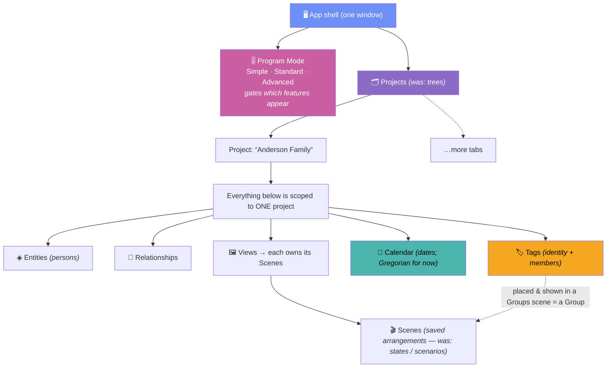

**Read it top-down:** the whole app runs at one of three **Program Modes** (feature tiers).
One window opens one **project** at a time (tabs switch between them). A project owns its
entities, relationships, tags, calendar, and — per view — its scenes.

> **Project = the old "tree".** The container is now a *Project*; the node-link picture is the
> *Graph* view. The word "tree" retires from the UI (a family graph with remarriage/adoption
> isn't a tree anyway).

---

## 2. Containment: what belongs to what

Solid arrow = "owns / cascades to". Dashed = "references" (following it backwards deletes
nothing).

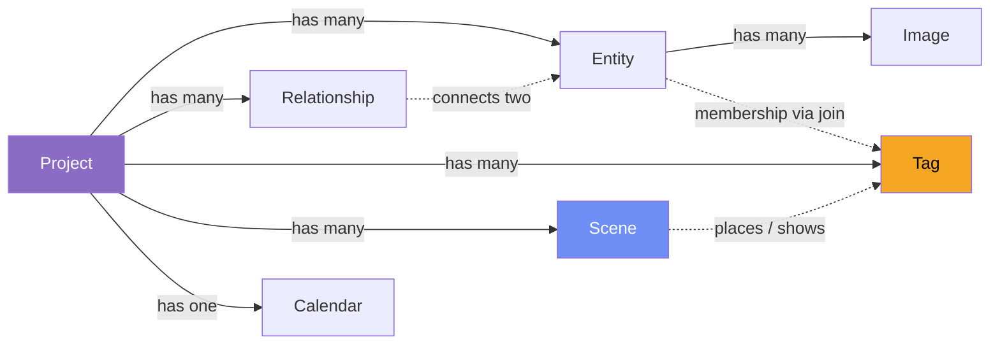

| Container | Owns | On delete, also removes |
|-----------|------|-------------------------|
| **Project** | entities, relationships, tags, scenes, images, calendar, settings | *everything* scoped to it |
| **Entity** *(person)* | its images (files too) | its relationships + its rows in the tag join + its placements in scenes |
| **Tag** | nothing (identity only) | its join rows + its placements in scenes (entities untouched) |
| **Scene** | its tag placements / positions | just itself (entities & tags untouched) |

Membership is a **many-to-many join** (`entity_tags`), so neither entities nor tags "own" the
other — see [§5](#5-tags-groups--scenes) and [data-model.md](./data-model.md).

---

## 3. The five views

All views read the **same** entities + relationships of the active project — different lenses,
not different data. You switch from the left **icon rail**; the store remembers your choice in
`activeView`.

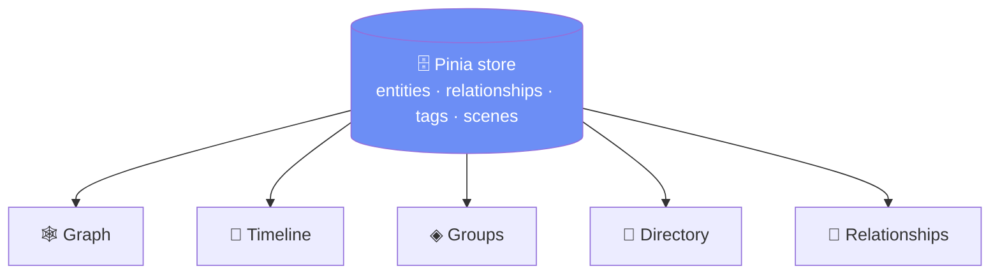

| View *(was)* | `activeView` | Shows | Draws | Interaction |
|--------------|--------------|-------|-------|-------------|
| 🕸️ **Graph** *(Tree)* | `graph` | node-link graph | **WebGL** | drag nodes; layout **types** (§4); drag entities in from the Directory tab |
| 📅 **Timeline** | `timeline` | lifelines on a date axis | **WebGL** | zoom time & width; will gain manual positions + scenes |
| ◈ **Groups** *(Factions)* | `groups` | entities clustered by tag | **WebGL** | drag to group; switch **scenes** (§5) |
| 👥 **Directory** *(All People)* | `directory` | searchable card grid | **DOM** (virtualized) | search, sort, click a card |
| 🔗 **Relationships** | `relationships` | editable table + issue detection | **DOM** (virtualized) | edit rows, spot bad data |

> Spatial views (Graph/Timeline/Groups) draw only **placed** entities — you add entities to a
> scene by dragging them from the **Directory tab** of the right dock (§7). WebGL views stay
> mounted (hidden) when inactive so their GL context & layout survive view switches.

---

## 4. Graph layout **types** & **scenes**

A **type** *(was: mode)* is *how nodes are arranged*. A **scene** *(was: state)* is a *named,
saved arrangement*. **The type is a property of the scene** — each scene picks one:

```
  SCENE  "Reunion"     → type Free       → { entityId → {x,y} } + style overrides
  SCENE  "Big picture" → type Organic
  SCENE  "Pedigree"    → type Generations
```

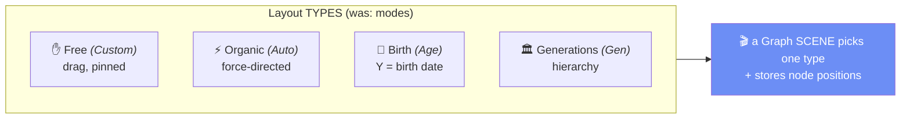

| Type *(was)* | Icon | Arrangement rule | Drag behavior |
|--------------|------|------------------|---------------|
| **Free** *(Custom)* | ✋ | nodes stay where you put them | free — positions persist |
| **Organic** *(Auto)* | ⚡ | d3-force finds a layout | perturbs the physics |
| **Birth** *(Age)* | 📅 | vertical position = **birth date** (older higher) | X free, Y locked; shows date + **Present** line |
| **Generations** *(Gen)* | 🏛 | top-down hierarchy from parent/child + spouse | drag between rows to re-generation |

Switching type/scene is always **snapshot-then-animate**:

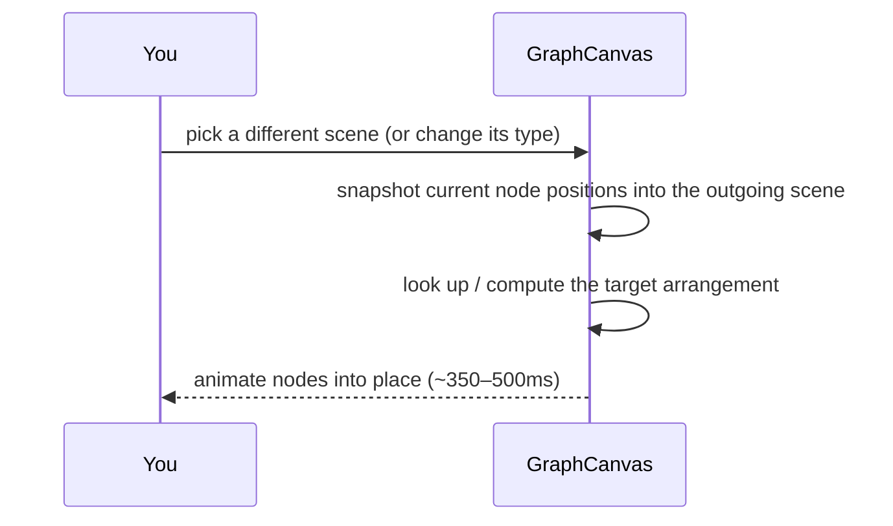

Layout math stays in **pure functions** (`layoutAge`/`familyTreeLayout`) — no store or WebGL
dependency — so it's easy to test. See [graph.md](./graph.md).

---

## 5. Tags, Groups & Scenes

### 5.1 Tags — a many-to-many join

A **tag** is a labelled set of entities (a family, a house, a team, "Villains", "Engineers").
Membership is a **join** (`entity_tags`), not an array owned by either side, so both lookups are
O(1) via in-memory index Maps:

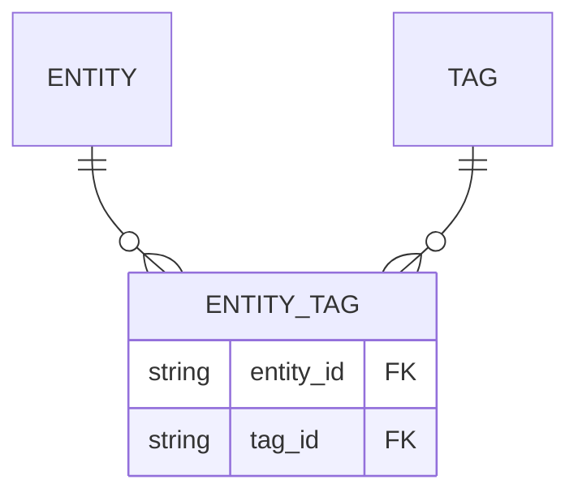

- **Manual tags** — user assigns members (stored in the join).
- **Derived (smart) tags** — computed from an existing field (occupation / location / birth
  decade); **not stored**, self-updating. *(Planned; see [design.md](./design.md).)*

### 5.2 A **Group** is a tag placed in a scene

The old "faction" mashed two jobs together. We split them:

| Job | Was (Faction) | Now |
|-----|---------------|-----|
| *who belongs* | `member_ids`, **copied per scenario** | **Tag** (one member set, shared everywhere) |
| *where it sits / is shown* | `x`,`y`,`visible`,`scenario_id` on the faction | **scene placement** (`scene_tags`) |

So membership is global; a **Groups scene** just references some tags and positions them. A
**Group** = "a tag shown in a Groups scene."

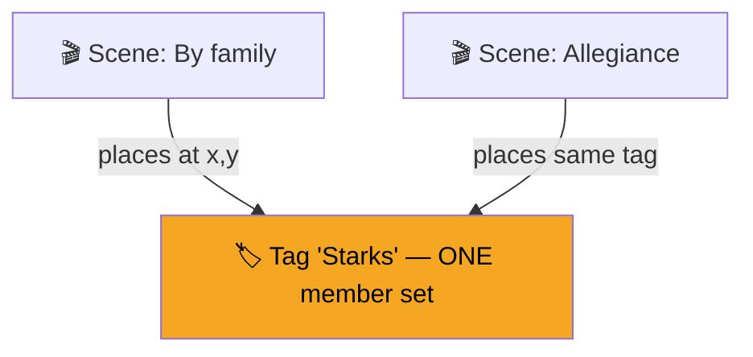

This is why *"factions move between scenarios"* is now trivial — membership never moves.

### 5.3 Scenes are per-view (this replaces both "states" and "scenarios")

A **scene** is a saved state of **one** view. Each spatial view keeps its own set:

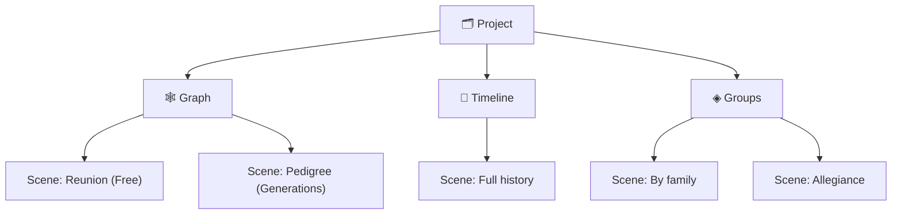

| View | Was called | Now |
|------|-----------|-----|
| Graph | "state" | **Scene** (carries a layout type) |
| Timeline | *(none yet)* | **Scene** (lane order + manual positions + zoom) |
| Groups | "scenario" | **Scene** (which tags shown + their placements) |

The **Scene tab strip** at the bottom of the canvas shows only the *current* view's scenes and
swaps as you switch views. Directory & Relationships have no positions → no scenes.

---

## 6. Program Modes & the Save model

### 6.1 Program Modes (app-wide feature tiers) — *not* the graph layout types

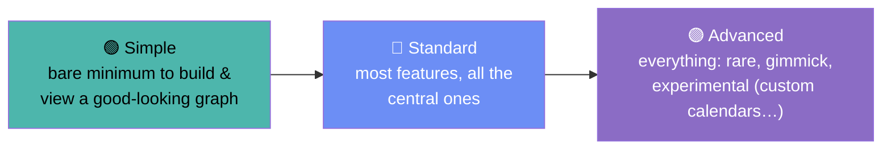

Higher modes reveal more of the UI (rail items, pill tools, popovers) — pure **progressive
disclosure**, no separate screens. Stored per project (or globally) as `mode`.

### 6.2 Save model — autosave **and** a manual checkpoint

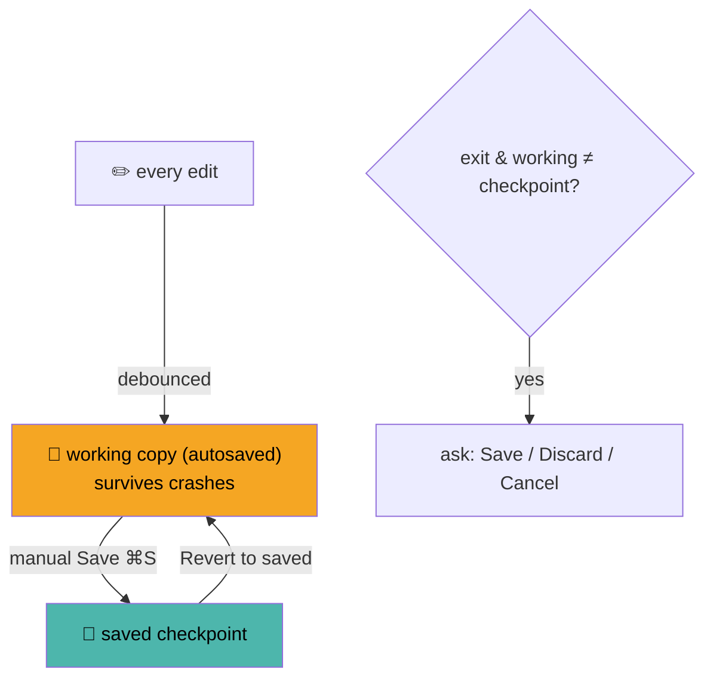

Everything **autosaves** (nothing lost to a crash); a manual **Save** commits a checkpoint;
**Revert to saved** discards everything since. On exit, if the working copy differs from the
checkpoint you're asked *Save / Discard / Cancel*. The old on-canvas **Save Layout** button and
`graphDirty` pulse are replaced by this; **Save** / **Revert** live in the **Project ▾** menu.

---

## 7. The shell (screen layout)

```
┌──────────────────────────────────────────────────────────────────────┐
│ ≡ Project ▾   Scene: Reunion ▾    🔍 ⌘K    Mode: Standard ▾    ◐   ⚙  │ top bar
├───┬─────────────────────────────────────────────┬────────────────────┤
│🕸 │                                             │  RIGHT DOCK        │
│👥 │                                             │ ┌────────┬────────┐ │
│🔗 │            ACTIVE VIEW (canvas)             │ │Inspector│Directory│ │ tabs
│📅 │                                             │ ├────────┴────────┤ │
│◈  │      ╭──── bottom tool pill ────╮            │ │ Inspector: the  │ │
│   │      │ Type▾ ⊕−⊡ Focus▾ Legend  │           │ │  clicked entity │ │
│＋ │      ╰───────────────────────────╯           │ │ Directory: full │ │
│⚙  │                                             │ │  list, drag →   │ │
│   ├─────────────────────────────────────────────┤ │  canvas         │ │
│   │ Scene tabs (this view): ▸Reunion ▸Big pic + │ └─────────────────┘ │
└───┴─────────────────────────────────────────────┴────────────────────┘
  icon rail: 🕸Graph 👥Directory 🔗Relationships 📅Timeline ◈Groups · ＋ · ⚙
```

| Zone | Holds *(was)* |
|------|---------------|
| **Icon rail** (left) | the 5 views + add + settings *(was: left sidebar nav list)* |
| **Top bar** | Project menu (Export/Import/**Save**/**Revert**/stats), Scene switcher, ⌘K search, **Mode** picker, theme, ⚙ |
| **Canvas** | active view + one **bottom tool pill** (Type + zoom + **Focus** *(was Highlights)* + Legend) + **Scene tab strip** |
| **Right dock** | **Inspector** tab (selected entity) + **Directory** tab (draggable roster) *(replaces the always-on people list)* |

**Clean View** *(was Clean Tree)* hides the canvas overlays for an unobstructed look.
**Style** *(was Graph Settings)* holds node/link appearance. **Present** *(was Current Date)*
sets the reference "now" date for age / living-vs-deceased.

---

## 8. State — the single Pinia store

One store (`main`) is the source of truth for the renderer, grouped by purpose:

| Group | Fields | Purpose |
|-------|-------------------|---------|
| **Data** | `entities`(persons), `relationships`, `tags`, `entityTags`, `scenes`, `projects` | loaded records for the active project |
| **Active selection** | `activeProjectId`, `activeView`, `activeSceneId` (per view), `selectedEntityId` | what's open / focused |
| **UI flags** | `inspectorTab`, `formOpen`, `settingsOpen`, `cleanView`, `theme`, `programMode` | panels, modals, theme, feature tier |
| **View tuning** | `graphStyle`, `present` (date), save-checkpoint state | appearance + the "now" marker |
| **Computed** | `activeProject`, `activeScene`, `tagsOf`/`membersOf` indexes, `selectedEntity`, counts | derived, never stored |

**Golden rule — the data-access chain.** Components never touch disk; they call a store action
→ the api seam → the backend:

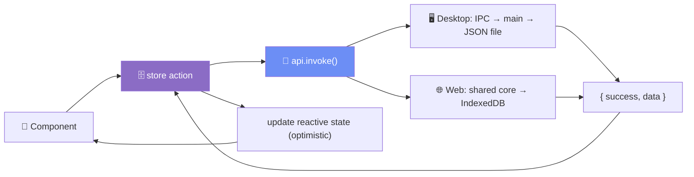

Same store/api/components run on **desktop and web** — only the bottom layer (JSON file vs.
IndexedDB) differs. See [architecture.md](./architecture.md).

---

## 9. What "active" means — one thing at a time

```
  ┌─ programMode ── Simple / Standard / Advanced (app-wide) ─────────┐
  │ ┌─ activeProjectId ── which project/tab is open ───────────────┐ │
  │ │ ┌─ activeView ── which of the 5 views ───────────────────┐   │ │
  │ │ │   Graph/Timeline/Groups → activeSceneId (this view)     │   │ │
  │ │ │   Graph scene → its layout TYPE                         │   │ │
  │ │ │   ┌─ selectedEntityId ── shown in the Inspector ─────┐  │   │ │
  │ │ │   └───────────────────────────────────────────────────┘  │   │ │
  │ │ └────────────────────────────────────────────────────────┘   │ │
  │ └──────────────────────────────────────────────────────────────┘ │
  └────────────────────────────────────────────────────────────────────┘
```

Switching **project** resets selection/modals and reloads data. Switching **view** keeps the
data and swaps the lens (spatial views stay alive in the background).

---

## 10. Glossary

| Term | In the code | Was | Plain meaning |
|----------|------------------------|-----|---------------|
| **Project** | `Project`, `activeProjectId` | Tree | top-level workspace (a tab) |
| **Graph** view | `activeView='graph'` | Tree view | the node-link visualization |
| **Directory** view | `activeView='directory'` | All People | searchable grid of all entities |
| **Groups** view | `activeView='groups'` | Factions | tag-clustering view |
| **Entity** | `Person` record | Person | a node (person / creature / object…) |
| **Tag** | `Tag` + `entity_tags` join | Faction membership | a labelled set of entities |
| **Group** | a `scene_tag` placement | Faction | a tag placed in a Groups scene |
| **Scene** | `Scene` (has `view`) | state **and** scenario | a saved arrangement of one view |
| **Type** | `scene.type` | mode | layout algorithm of a Graph scene |
| **Program Mode** | `programMode` | *(none)* | Simple/Standard/Advanced feature tier |
| **Focus** | Focus panel | Highlights | non-destructive emphasis |
| **Style** | Style panel | Graph Settings | node/link appearance |
| **Clean View** | `cleanView` | Clean Tree | hide canvas overlays |
| **Present** | `present` | Current Date / "as-of year" | reference "now" date |
| **Inspector** / **Directory tab** | right dock tabs | always-on member list | selection details / drag roster |

---

See also: [OVERHAUL_GUIDE.md](./OVERHAUL_GUIDE.md) · [architecture.md](./architecture.md) ·
[data-model.md](./data-model.md) · [graph.md](./graph.md) · [design.md](./design.md)
