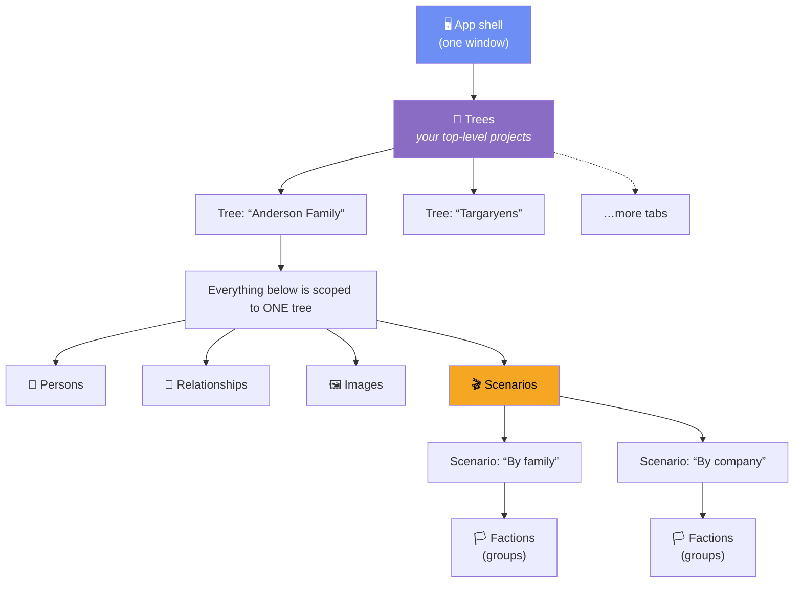
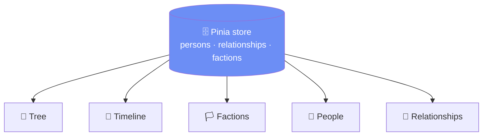
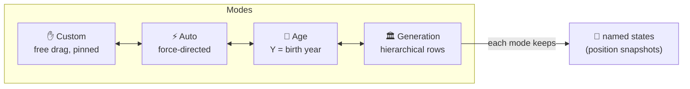
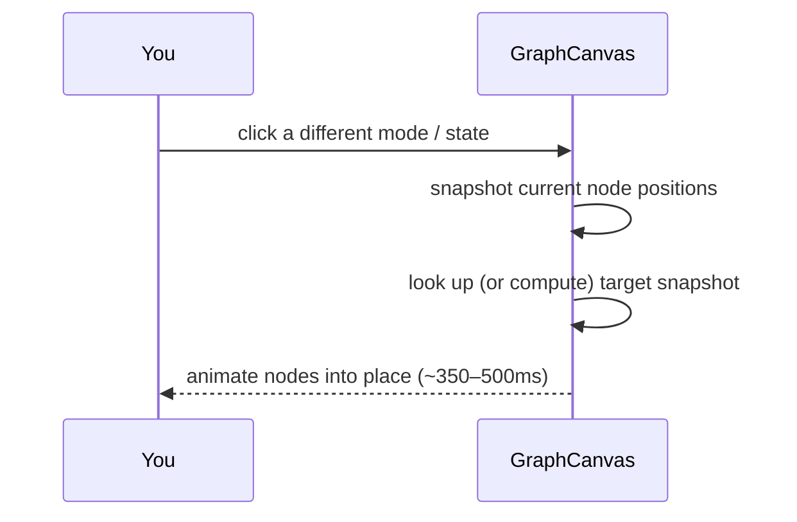
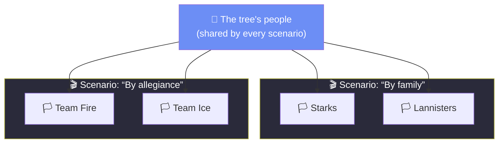
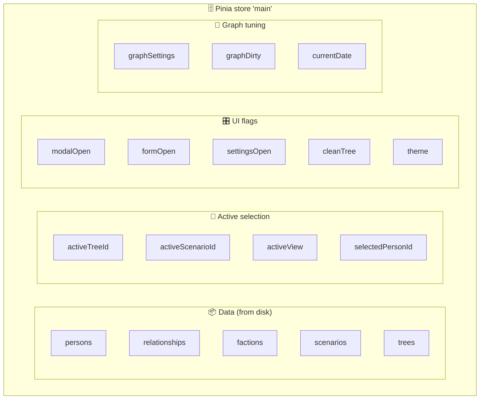
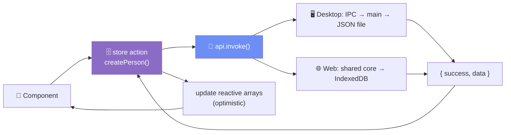

# Client-side structure — a visual guide

A map of what the app *is* from the inside: the containers your data lives in
(**trees**), the five **views** that draw it, the graph **modes** and their saved
**states**, the **scenarios** that reshape the Factions view, and the single **store**
that ties it all together.

This is the "what are all these words?" doc. For process/architecture see
[architecture.md](./architecture.md); for the exact data shapes see
[data-model.md](./data-model.md); for the deep graph internals see [graph.md](./graph.md).

---

## 1. The vocabulary in one picture



**Read it top-down:** one window opens one **tree** at a time (tabs switch between
them). A tree owns all its people, relationships, and photos. **Scenarios** and
**factions** are an extra grouping layer used only by the Factions view.

> **"Project" = "Tree".** There's no separate "project" concept in the code — a *tree*
> is the top-level workspace/project. Each one is a tab across the top bar.

---

## 2. Containment: what belongs to what

Every arrow means "owns / cascades to". Delete a container and everything below it goes
with it.

```mermaid
flowchart LR
    Tree -->|has many| Person
    Tree -->|has many| Relationship
    Tree -->|has many| Scenario
    Person -->|has many| Image
    Scenario -->|has many| Faction
    Faction -.->|references<br/>(member_ids)| Person
    Relationship -.->|connects two| Person

    style Tree fill:#8b6cc5,color:#fff
    style Scenario fill:#f5a623,color:#000
    style Faction fill:#f5a623,color:#000
```

| Container | Owns | On delete, also removes |
|-----------|------|-------------------------|
| **Tree** | persons, relationships, scenarios, images, settings | *everything* scoped to it |
| **Person** | its images (files on disk too) | its relationships + its membership in every faction |
| **Scenario** | its factions | its factions (people are **untouched**) |
| **Faction** | nothing (just a membership list) | just itself (people untouched) |

Solid arrows = ownership. Dashed arrows = *reference* (a faction points at people by ID;
a relationship points at two people) — following a dashed arrow backwards never deletes
anything.

---

## 3. The five views

All five views read the **same** people + relationships of the active tree — they're
different lenses, not different data. You switch with the left-sidebar nav; the store
remembers your choice in `activeView`.



| View | `activeView` | What it shows | How it draws | Interaction |
|------|--------------|---------------|--------------|-------------|
| 🌳 **Tree** | `tree` | The family graph — nodes + links | **WebGL** (Three.js) | Drag nodes, 4 layout **modes** (§4) |
| 📅 **Timeline** | `timeline` | Vertical lifelines on a year axis | **WebGL** | Zoom time & width; birth/marriage ribbons |
| 🏳️ **Factions** | `factions` | People clustered into groups | **WebGL** | Drag-to-group; switch **scenarios** (§5) |
| 👥 **People** | `people` | Searchable card grid | **DOM** (virtualized) | Search, sort, click a card |
| 🔗 **Relationships** | `relationships` | Editable table + issue detection | **DOM** (virtualized) | Edit rows, spot bad data |

**Two rendering families:**

```
   WebGL views (thousands of nodes, 60fps)      DOM views (virtualized lists)
   ┌───────────────────────────────┐            ┌──────────────────────────┐
   │  Tree · Timeline · Factions    │            │  People · Relationships   │
   │  pure layout math  →  renderer │            │  only visible rows exist  │
   │  steps OUTSIDE Vue reactivity  │            │  in the DOM (windowing)   │
   └───────────────────────────────┘            └──────────────────────────┘
```

> The **Tree** view stays mounted (just hidden) when you switch away, so its simulation
> and layout survive — coming back is instant.

---

## 4. Graph modes & states (Tree view only)

The Tree view has **4 layout modes**. Think of a mode as *"how nodes are arranged"*, and
a **state** as *"a saved snapshot of positions within that mode"*. Every mode can hold
several named states.

```
  MODE  (arrangement strategy)
   └── STATE 1  { personId → {x, y} }   ← a saved position snapshot
   └── STATE 2  { personId → {x, y} }
   └── STATE 3  …

  4 modes × N states each  →  serialized into the tree's `graphState` setting
```



| Mode | Icon | Arrangement rule | Drag behavior |
|------|------|------------------|---------------|
| **Custom** | ✋ | Nodes stay exactly where you put them (pinned) | Free — positions persist |
| **Auto** | ⚡ | D3 force simulation finds a layout | Perturbs the physics |
| **Age** | 📅 | Vertical position locked to **birth year** (older = higher) | X free, Y locked; shows year + "Now" lines |
| **Generation** | 🏛 | Top-down hierarchy from parent/child + spouse links | Drag between rows to re-generation |

**Switching is always snapshot-then-animate:**



Changing positions marks the layout **dirty** (`graphDirty`) → the **Save Layout** button
pulses. Nothing auto-saves; closing with unsaved changes prompts *Save / Discard / Cancel*.

---

## 5. Scenarios & factions (Factions view only)

A **faction** is any group you invent — a family, a company, a house, an elemental
affinity. A **scenario** is a *whole set of factions* over the same people. The Factions
view shows **one scenario at a time**; a bottom bar switches between them.



Same people, two totally different groupings. Membership is just an ID list on each
faction, so **one person can belong to many factions** (they settle *between* their
groups on screen, with tether threads + a count badge).

| Concept | Analogy | Key facts |
|---------|---------|-----------|
| **Scenario** | A "save slot" for a grouping idea | Owns its factions; switching is instant; the active one is remembered per tree (`activeScenarioId`) |
| **Faction** | A labeled bubble on the stage | Has color, icon, position, visibility, and a `member_ids` list |
| **Membership** | Tags, not folders | A person can be in 0, 1, or many factions; edited by drag-and-drop |

> Same-named factions in different scenarios are treated as "the same group" so they
> glide smoothly when you switch scenarios.

---

## 6. State — the single Pinia store

One store (`main`) is the source of truth for the whole renderer. Everything the UI
shows comes from here. Grouped by purpose:



| Group | Fields | What they're for |
|-------|--------|------------------|
| **Data** | `persons`, `relationships`, `factions`, `scenarios`, `trees` | The loaded records for the active tree (reactive arrays) |
| **Active selection** | `activeTreeId`, `activeScenarioId`, `activeView`, `selectedPersonId` | What's currently open / focused |
| **UI flags** | `modalOpen`, `formOpen`, `settingsOpen`, `cleanTree`, `theme`, `lockNodes`, `lockLines` | Toggle panels, modals, theme |
| **Graph tuning** | `graphSettings`, `graphDirty`, `currentDate` (`userCurrentYear` / `autoCurrentYear`) | Node/link appearance, unsaved-layout flag, the "now" year |
| **Computed** | `activeTree`, `activeScenario`, `activeFactions`, `selectedPerson`, `personCount`, `coupleCount` | Derived, never stored |

**Golden rule — the data-access chain.** Components never talk to disk directly. They
call a **store action**, which calls the **api seam**, which reaches the backend:



The same store, api, and components run on **desktop and web** — only the bottom layer
(JSON file vs. IndexedDB) differs. See [architecture.md](./architecture.md).

---

## 7. What "active" means — one thing at a time

The app is always in exactly one of each of these. Switching any of them re-scopes what
you see below it.

```
  ┌─ activeTreeId ─────────────────────────────────────────────┐
  │   which tree/project is open   (top-bar tabs)               │
  │                                                             │
  │   ┌─ activeView ──────────────────────────────────────┐    │
  │   │   which of the 5 views is showing (left nav)        │    │
  │   │                                                     │    │
  │   │   Tree view →   graph MODE + active STATE           │    │
  │   │   Factions →    activeScenarioId                    │    │
  │   │                                                     │    │
  │   │   ┌─ selectedPersonId ──────────────────────────┐  │    │
  │   │   │  which person's modal/sidebar is focused      │  │    │
  │   │   └───────────────────────────────────────────────┘  │    │
  │   └─────────────────────────────────────────────────────┘    │
  └─────────────────────────────────────────────────────────────┘
```

Switching **tree** resets selection, modals, and the dirty flag, then reloads all data.
Switching **view** keeps the data; it just changes the lens (and the Tree view stays
alive in the background).

---

## 8. Screen layout (the shell)

```
┌───────────────────────────────────────────────────────────────────────┐
│  ▸ Anderson Family   ▸ Targaryens   [ + ]           ← tree tabs (top)   │
├──────────┬──────────────────────────────────────────────┬─────────────┤
│          │                                              │             │
│  LEFT    │                                              │   RIGHT     │
│ sidebar  │            CENTRAL WORKSPACE                 │  sidebar    │
│          │       (one of the 5 views at a time)         │             │
│ • nav    │                                              │ • member    │
│ • stats  │     🌳 / 📅 / 🏳️ / 👥 / 🔗                    │   list      │
│ • data   │                                              │   (virtual- │
│ • theme  │                                              │    ized)    │
│ • year   │                                              │             │
│          │                                              │             │
└──────────┴──────────────────────────────────────────────┴─────────────┘
     ↑ resizable                                        resizable ↑
```

Both sidebars are resizable. **Clean Tree** mode (`cleanTree`) slides the graph's overlay
panels away for an unobstructed view.

---

## 9. Glossary

| Term | In the code | Plain meaning |
|------|-------------|---------------|
| **Tree / Project** | `Tree`, `activeTreeId` | A whole family tree — the top-level workspace (a tab) |
| **View** | `activeView` | One of the 5 ways to look at the tree's data |
| **Mode** | `enter*Mode`, `graphState.mode` | A layout strategy for the **Tree** view (Custom/Auto/Age/Generation) |
| **State** | `modeStateSnapshots` | A saved snapshot of node positions within a mode |
| **Scenario** | `Scenario`, `activeScenarioId` | A saved set of factions over the same people (Factions view) |
| **Faction** | `Faction`, `member_ids` | A user-defined group of people |
| **Store** | Pinia `main` | The single in-memory source of truth for the UI |
| **Backend / seam** | `api/backends/*` | The swappable layer that persists data (file vs. IndexedDB) |
| **Dirty** | `graphDirty` | The tree layout has unsaved position changes |

---

See also: [architecture.md](./architecture.md) · [data-model.md](./data-model.md) ·
[graph.md](./graph.md) · [design.md](./design.md)
