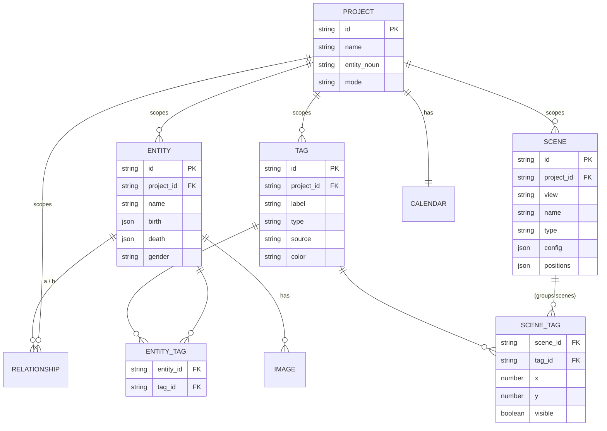
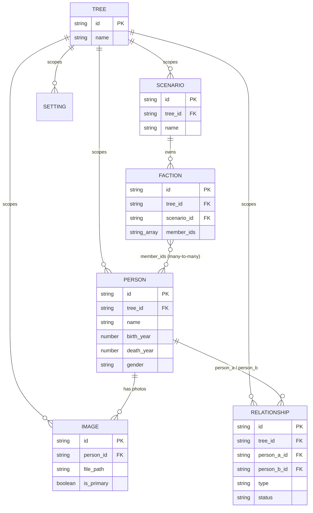
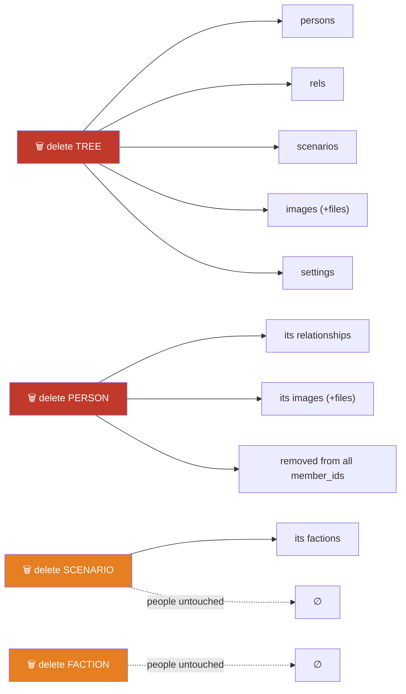
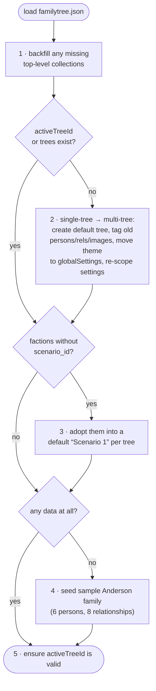

# Data model

All application data is stored in a single JSON file, `familytree.json`, under
Electron's `userData` directory. The main process reads it once at startup into an
in-memory object and rewrites the whole file on every mutation. See
[`db.js`](../src/main/db.js).

> 📐 **Two models in this doc.** The [**Target model**](#target-model-in-progress) is what the
> overhaul is moving to (see [`client-structure.md`](./client-structure.md) and
> [`OVERHAUL_GUIDE.md`](./OVERHAUL_GUIDE.md)). The [**Current model**](#current-model) below it
> is still accurate to today's code until those steps land.

---

## Target model (in progress)

The renamed, generalized shape. Everything is still keyed by UUID in object maps; the changes
are **new names**, a **tags join**, **scenes** (unifying states + scenarios), and **structured
dates**.

```jsonc
{
  "projects":        { "<id>": { /* Project: name, entity_noun, mode, calendar */ } },
  "activeProjectId": "<id> | null",
  "persons":         { "<id>": { /* Entity: name, gender, birth, death, … */ } },
  "relationships":   { "<id>": { /* + formed: DateValue */ } },
  "tags":            { "<id>": { /* label, type, source, color, icon */ } },
  "entity_tags":     { "<id>": { "entity_id": "…", "tag_id": "…" } },   // many-to-many JOIN
  "scenes":          { "<id>": { /* project_id, view, name, type?, config, positions */ } },
  "scene_tags":      { "<id>": { /* scene_id, tag_id, x, y, visible */ } }, // groups scenes
  "images":          { "<id>": { /* … */ } },
  "settings":        { "<projectId>:<key>": "<value>" },
  "globalSettings":  { "theme": "dark", "programMode": "standard" }
}
```

### Target ER diagram



### Key entity changes

| Now | Target | Change |
|-----|--------|--------|
| `trees` | `projects` | rename; `tree_id` → `project_id` everywhere; add `entity_noun` (default `"Person"`), `mode`, `calendar` |
| `persons.birth_year` / `death_year` (number) | `persons.birth` / `death` (**DateValue**) | structured & mutable so custom calendars slot in later (below) |
| `relationships.formed_date` (number) | `relationships.formed` (**DateValue**) | same |
| `factions{ member_ids, scenario_id, x, y, visible }` | `tags` + `entity_tags` + `scene_tags` | membership becomes a **join** on the tag (global); placement moves to the scene |
| `scenarios` | `scenes` where `view='groups'` | unify with graph states |
| `graphState` setting (modes → states → snapshots) | `scenes` where `view='graph'` | each scene carries its layout **type** (flattened — no separate mode buckets) |
| *(new)* | `scenes` where `view='timeline'` | manual timeline positions, when they ship |

### DateValue — mutable structured dates

Even though only **Gregorian** is used for now (usually just a year), dates are stored as a
**structured, mutable object** rather than a bare number, so custom calendars (a future feature
— see [design.md](./design.md)) are a data-compatible change, not a migration:

```jsonc
"birth": {
  "year": 1950,
  "month": null,        // null = unknown / not entered
  "day":   null,
  "precision": "year",  // "year" | "month" | "day"
  "calendar": "gregorian"
}
```

- Partial precision is first-class (a birth year alone is `precision:"year"`).
- Sorting/spacing (Birth layout, Timeline) go through a pure `calendarMath.toOrdinal(date, cal)`
  so the layout code never special-cases a calendar.
- `null` (unknown date) stays valid everywhere.

### Groups, tags & scenes

- A **Group** is a `scene_tag` row — a tag placed at `(x,y)`/`visible` inside a Groups scene.
  Membership is **not** stored on the group; it lives on the tag via `entity_tags`, so a tag can
  appear in any number of scenes and "moving a faction between scenarios" is trivial.
- Build two in-memory index Maps at load (`tagsOf[entityId]`, `membersOf[tagId]`) so both
  directions are O(1). Derived (smart) tags are computed from an entity field and never stored.

### Target migration (implemented by the guide)

`initDB()` gains steps that run once on an old file: rename `trees`→`projects` (+`project_id`);
wrap `birth_year`/`death_year`/`formed_date` numbers as `DateValue`; convert each faction into a
tag (dedupe by name) + `entity_tags` rows + one `scene_tag` per scenario placement; turn
`scenarios` into `view='groups'` scenes and the `graphState` blob into `view='graph'` scenes
(mode → `scene.type`); default `programMode='standard'`, `entity_noun='Person'`,
`calendar='gregorian'`. All covered by [`tests/db.test.js`](../tests/db.test.js).

---

## Current model

*Accurate to today's code, until the overhaul steps land.*

## Top-level shape

```jsonc
{
  "trees":          { "<treeId>": { /* Tree */ } },
  "activeTreeId":   "<treeId> | null",
  "persons":        { "<personId>": { /* Person */ } },
  "relationships":  { "<relId>":   { /* Relationship */ } },
  "factions":       { "<factionId>": { /* Faction */ } },
  "scenarios":      { "<scenarioId>": { /* Scenario */ } },
  "images":         { "<imageId>": { /* Image */ } },
  "settings":       { "<treeId>:<key>": "<value>" },   // per-tree
  "globalSettings": { "theme": "dark" }                // app-wide
}
```

Every collection is keyed by ID (an object map, not an array). All IDs are v4 UUIDs
generated with Node's `crypto.randomUUID()`. Timestamps are stored as
`"YYYY-MM-DD HH:MM:SS"` strings (`nowStr()`), in local time.

## Entity relationships at a glance



Everything hangs off **Tree** — it's the scoping root. A `FACTION` is the only
many-to-many join (a person can be in many factions; a faction holds many people), and
it's stored as a plain `member_ids` array rather than a join table.

## Entities

### Tree

A named family tree. The app supports multiple trees; each is shown as a tab in the
top bar, and all persons/relationships/images/settings are scoped to one tree.

| Field | Type | Notes |
|-------|------|-------|
| `id` | string (UUID) | |
| `name` | string | Defaults to `"Unnamed Family Tree"`. |
| `created_at` | string | |
| `updated_at` | string | Bumped on rename. |

### Person

| Field | Type | Notes |
|-------|------|-------|
| `id` | string (UUID) | |
| `tree_id` | string | Owning tree. |
| `name` | string | Full name; the UI splits first/last on whitespace. |
| `birth_year` | number \| null | |
| `death_year` | number \| null | |
| `gender` | `"male"` \| `"female"` \| `"unknown"` | Drives node color. |
| `bio` | string | |
| `occupation` | string | |
| `location` | string | |
| `created_at` / `updated_at` | string | |

`persons:getAll` enriches each row with a computed `primary_image` (the file path of
the person's primary image, or `null`) — this field is **not** persisted, it is
derived from the `images` collection on read.

### Relationship

An undirected-ish edge between two persons. Direction matters for `parent_child` and
`adopted` (A is the parent/adopter of B); for `spouse` the order is not meaningful.

| Field | Type | Notes |
|-------|------|-------|
| `id` | string (UUID) | |
| `tree_id` | string | |
| `person_a_id` | string | For `parent_child`/`adopted`: the **parent**. |
| `person_b_id` | string | For `parent_child`/`adopted`: the **child**. |
| `type` | `"parent_child"` \| `"spouse"` \| `"adopted"` | |
| `status` | `"active"` \| `"divorced"` | Meaningful for `spouse`. |
| `formed_date` | number \| null | Marriage / relationship start year. |
| `created_at` | string | |

Deleting a person cascades: all relationships referencing it and all its images
(files included) are removed, and the person is dropped from every faction's
`member_ids`.

**Cascade map** — what each delete takes down with it:



Deleting a **faction** or a **scenario** never deletes people — it only removes the
grouping. Deleting a **person** or a **tree** is the destructive direction.

### Faction

A user-defined group shown in the **Factions** view — a family, company, school,
house, elemental affinity, or any other camp. Membership is a plain ID list on the
faction (people may belong to any number of factions). Every faction belongs to a
**scenario**; the view shows one scenario at a time.

| Field | Type | Notes |
|-------|------|-------|
| `id` | string (UUID) | |
| `tree_id` | string | |
| `scenario_id` | string | Owning scenario. |
| `name` | string | Defaults to `"New Faction"`. Same-name factions in different scenarios are treated as "the same faction" when animating scenario switches. |
| `description` | string | Free text shown as a tooltip in the manager panel. |
| `color` | string | Hex color; drives the zone ring and membership arcs. |
| `icon` | string | Emoji shown in the zone header. |
| `member_ids` | string[] | Person IDs belonging to the faction. |
| `x` / `y` | number | Zone centre in the Factions view's world space. |
| `visible` | boolean | Hidden factions don't render or attract members. |
| `created_at` / `updated_at` | string | |

### Scenario

A named configuration of factions in the **Factions** view. Scenarios share the
tree's people but each holds its own faction set (e.g. "By family" vs. "By
company"). Deleting a scenario cascades its factions; people are untouched. The
per-tree setting `activeScenarioId` remembers which scenario is open.

| Field | Type | Notes |
|-------|------|-------|
| `id` | string (UUID) | |
| `tree_id` | string | |
| `name` | string | Defaults to `"New Scenario"`. |
| `created_at` / `updated_at` | string | |

### Image

| Field | Type | Notes |
|-------|------|-------|
| `id` | string (UUID) | |
| `tree_id` | string | |
| `person_id` | string | Owning person. |
| `file_path` | string | Absolute path inside `userData/images/`. |
| `is_primary` | boolean | At most one primary per person. |
| `created_at` | string | |

On `images:add`, the source file selected by the user is **copied** into
`userData/images/<uuid><ext>` — the original is never referenced. Setting a new
primary clears the flag on the person's other images. Deleting an image unlinks the
file from disk.

### Settings

Two distinct scopes:

- **`settings`** — per-tree, keyed by `"<treeId>:<key>"`. Notable keys:
  - `graphState` — the serialized graph layout (modes, states, node positions,
    generation rows). See [graph.md](./graph.md#persistence).
  - `graph_<name>` — individual graph appearance settings.
- **`globalSettings`** — app-wide. Currently just `theme` (`"dark"` / `"light"`).

## Migrations

`initDB()` runs on every load and brings any older file up to the current shape:



In prose, `initDB()` is idempotent and self-migrating. On load it:

1. Ensures every top-level collection exists (backfills empty objects).
2. **Single-tree → multi-tree migration:** if there is no `activeTreeId` and no
   trees, it creates a default tree, tags any pre-existing persons/relationships/
   images with the new `tree_id`, migrates the old flat `theme` setting into
   `globalSettings`, and re-scopes remaining settings under the `"<treeId>:"` prefix.
3. **Scenario adoption:** factions created before scenarios existed (no
   `scenario_id`) are adopted into a default `"Scenario 1"` created per tree.
4. **First-run seeding:** a fresh install with no data seeds a sample three-
   generation Anderson family (6 persons, 8 relationships) so the graph is not empty.
5. Falls back to the first available tree if `activeTreeId` is missing.

These paths are covered by [`tests/db.test.js`](../tests/db.test.js) — see
[developer.md](./developer.md#testing).

## Data integrity

The store does not enforce referential integrity at write time; the
**Relationships** view surfaces problems instead (self-links, orphaned references,
duplicates, conflicting pairs, temporal inconsistencies, more than two parents). This
keeps the write path simple and lets users fix imported or hand-edited data
interactively.
