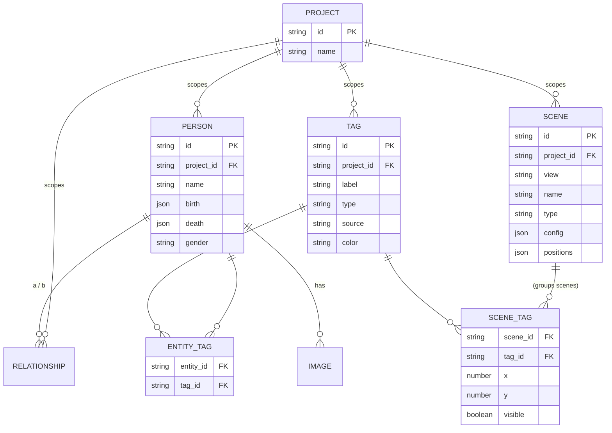
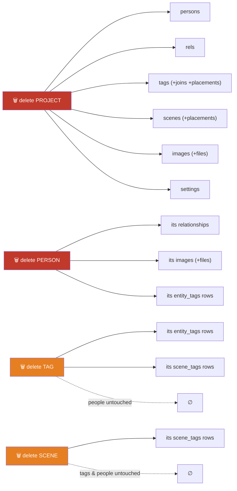

# Data model

All application data is stored in a single JSON file, `familytree.json`, under
Electron's `userData` directory. The main process reads it once at startup into an
in-memory object and rewrites the whole file on every mutation. See
[`db.js`](../src/main/db.js). On the web build the same data lives in a single
IndexedDB record instead (photos inline as data URLs) — see
[`api/backends/local.ts`](../src/renderer/src/api/backends/local.ts).

## Top-level shape

```jsonc
{
  "projects":        { "<id>": { /* Project */ } },
  "activeProjectId": "<id> | null",
  "persons":         { "<id>": { /* Person (entity) */ } },
  "relationships":   { "<id>": { /* Relationship */ } },
  "tags":            { "<id>": { /* Tag */ } },
  "entity_tags":     { "<id>": { /* EntityTag — many-to-many JOIN */ } },
  "scenes":          { "<id>": { /* Scene (per-view saved arrangement) */ } },
  "scene_tags":      { "<id>": { /* SceneTag — a tag placed in a scene */ } },
  "images":          { "<id>": { /* Image */ } },
  "settings":        { "<projectId>:<key>": "<value>" },   // per-project
  "globalSettings":  { "theme": "dark", "programMode": "standard" }
}
```

Every collection is keyed by ID (an object map, not an array). All IDs are v4 UUIDs
generated with `crypto.randomUUID()`. Timestamps are stored as
`"YYYY-MM-DD HH:MM:SS"` strings (`nowStr()`), in local time.

## Entity relationships at a glance



Everything hangs off **Project** — it's the scoping root. Membership in a tag is the
`entity_tags` join (a person can carry many tags; a tag holds many people), and a
**Group** is a `scene_tags` row — a tag placed at `(x, y)`/`visible` inside a Groups
scene. Membership is never stored on the group, so the same tag can appear in any
number of scenes.

## Entities

### Project

A named workspace (shown as a tab in the top bar). All other records are scoped to
one project.

| Field | Type | Notes |
|-------|------|-------|
| `id` | string (UUID) | |
| `name` | string | Defaults to `"Unnamed Project"`. |
| `created_at` / `updated_at` | string | Bumped on rename. |

### Person (entity)

| Field | Type | Notes |
|-------|------|-------|
| `id` | string (UUID) | |
| `project_id` | string | Owning project. |
| `name` | string | Full name; the UI splits first/last on whitespace. |
| `birth` | DateValue \| null | See [DateValue](#datevalue--structured-dates). |
| `death` | DateValue \| null | |
| `gender` | `"male"` \| `"female"` \| `"unknown"` | Drives node color. |
| `bio` / `occupation` / `location` | string | |
| `created_at` / `updated_at` | string | |

`persons:getAll` enriches each row with a computed `primary_image` (the file path of
the person's primary image, or `null`) — this field is **not** persisted; it is
derived from the `images` collection on read.

### DateValue — structured dates

Dates are stored as a structured, mutable object rather than a bare number, so
custom calendars (a future feature — see [design.md](./design.md)) are a
data-compatible change, not a migration:

```jsonc
"birth": {
  "year": 1950,
  "month": null,        // null = unknown / not entered
  "day":   null,
  "precision": "year",  // "year" | "month" | "day"
  "calendar": "gregorian"
}
```

- Partial precision is first-class (a birth year alone is `precision:"year"`).
- Sorting/spacing (the Birth layout, the Timeline) go through the pure
  [`calendarMath.toOrdinal(date, calendar)`](../src/shared/calendarMath.ts) so
  layout code never special-cases a calendar. A year-precision Gregorian date maps
  exactly to its year.
- `null` (unknown date) stays valid everywhere.

### Relationship

An undirected-ish edge between two persons. Direction matters for `parent_child` and
`adopted` (A is the parent/adopter of B); for `spouse` the order is not meaningful.

| Field | Type | Notes |
|-------|------|-------|
| `id` | string (UUID) | |
| `project_id` | string | |
| `person_a_id` | string | For `parent_child`/`adopted`: the **parent**. |
| `person_b_id` | string | For `parent_child`/`adopted`: the **child**. |
| `type` | `"parent_child"` \| `"spouse"` \| `"adopted"` | |
| `status` | `"active"` \| `"divorced"` | Meaningful for `spouse`. |
| `formed` | DateValue \| null | Marriage / relationship start. |
| `created_at` | string | |

### Tag

A labelled set of entities (a family, a house, a team, "Villains") — identity only.
Membership lives in the `entity_tags` join; placement in the Groups view lives in
`scene_tags`.

| Field | Type | Notes |
|-------|------|-------|
| `id` | string (UUID) | |
| `project_id` | string | |
| `label` | string | Defaults to `"New Tag"`. |
| `type` | string | Free-form category (e.g. `family`); empty for plain tags. |
| `source` | `"manual"` \| `"derived"` | Derived (smart) tags are planned; only manual tags are stored today. |
| `color` / `icon` | string | Drive the chip and the Groups-view ring. |
| `created_at` / `updated_at` | string | |

### EntityTag (membership join)

| Field | Type | Notes |
|-------|------|-------|
| `id` | string (UUID) | |
| `entity_id` | string | The person. |
| `tag_id` | string | The tag. |
| `created_at` | string | |

`entity_tags:add` is idempotent per `(entity, tag)` pair. The store builds two
in-memory index Maps at load (`tagsOf.get(entityId)` → tags, `membersOf.get(tagId)`
→ entity ids) so both directions are O(1).

### Scene

A saved arrangement of **one** view. Groups scenes replace the old "scenarios";
graph scenes replace the old serialized `graphState` "states" — each graph scene
carries its own layout **type**.

| Field | Type | Notes |
|-------|------|-------|
| `id` | string (UUID) | |
| `project_id` | string | |
| `view` | `"graph"` \| `"groups"` \| `"timeline"` | Which view owns it. |
| `name` | string | Shown in the Scene tab strip. |
| `type` | string \| null | Graph layout type: `free` \| `organic` \| `birth` \| `generations`; `null` for non-graph scenes. |
| `config` | object | View-specific settings (generation rows, emphasis, …). |
| `positions` | object | `{ [personId]: {x, y} }` snapshots (graph scenes). |
| `created_at` / `updated_at` | string | |

The per-view active scene is remembered in the `activeSceneId:<view>` setting.

### SceneTag (a "Group")

A tag placed in a (groups) scene. Position and visibility live here; membership
stays on the tag's join, so "moving a group between scenes" never copies members.

| Field | Type | Notes |
|-------|------|-------|
| `id` | string (UUID) | |
| `scene_id` | string | Owning scene (scoped through it). |
| `tag_id` | string | The placed tag. |
| `x` / `y` | number | Zone centre in the Groups view's world space. |
| `visible` | boolean | Hidden placements don't render or attract members. |
| `created_at` / `updated_at` | string | |

`scene_tags:add` is idempotent per `(scene, tag)` pair.

### Image

| Field | Type | Notes |
|-------|------|-------|
| `id` | string (UUID) | |
| `project_id` | string | |
| `person_id` | string | Owning person. |
| `file_path` | string | Desktop: absolute path inside `userData/images/`. Web: a data URL. |
| `is_primary` | boolean | At most one primary per person. |
| `created_at` | string | |

On `images:add`, the source file selected by the user is **copied** into
`userData/images/<uuid><ext>` — the original is never referenced. Setting a new
primary clears the flag on the person's other images. Deleting an image unlinks the
file from disk.

### Settings

Two distinct scopes:

- **`settings`** — per-project, keyed by `"<projectId>:<key>"`. Notable keys:
  - `activeSceneId:<view>` — each spatial view's active scene.
  - `userCurrentYear` — the explicit Present-year override (empty = auto).
  - `checkpoint` — the saved checkpoint (serialized scenes + placements +
    Present override) that **Revert to saved** restores. See the save model in
    [client-structure.md §6.2](./client-structure.md#62-save-model--autosave-and-a-manual-checkpoint).
  - `graph_<name>` — individual graph appearance settings.
- **`globalSettings`** — app-wide: `theme` (`"dark"`/`"light"`) and `programMode`
  (`"simple"`/`"standard"`/`"advanced"`).

## Cascades



Deleting a **tag** or a **scene** never deletes people — it only removes grouping
and placement. Deleting a **person** or a **project** is the destructive direction.

## Migrations

`initDB()` runs on every load and brings any older file up to the current shape, in
order (each step is idempotent; the same chain runs on the web build's IndexedDB
record):

1. **tree → project rename** (`migrateTreesToProjects`) — `trees`→`projects`,
   `activeTreeId`→`activeProjectId`, `tree_id`→`project_id` on every row.
2. **years → DateValues** (`migrateYearsToDateValues`) — `birth_year`/`death_year`/
   `formed_date` numbers become year-precision DateValues (`null` stays `null`).
3. **scenarios → groups scenes** (`migrateScenariosToScenes`) — each scenario
   becomes a `view:'groups'` scene **keeping its id**, so faction `scenario_id`s
   and the saved active-scenario setting still resolve.
4. Factions created before scenarios existed are adopted into a default groups
   scene per project.
5. **factions → tags** (`migrateFactionsToTags`) — same-named factions across
   scenes collapse into ONE tag per project (colour/icon from the oldest
   occurrence); `member_ids` become deduped `entity_tags` rows; each faction
   becomes one `scene_tags` placement carrying its `x/y/visible`. The legacy
   `factions` collection is then removed.
6. **graphState → graph scenes** (`migrateGraphStateToScenes`) — every saved
   per-mode "state" in the serialized blob becomes a typed `view:'graph'` scene
   (Custom→`free`, Auto→`organic`, Age→`birth`, Generation→`generations`) carrying
   its positions and generation-row config; the previously-active mode+state
   becomes the active graph scene, the current-year override moves to the
   `userCurrentYear` setting, and the blob is retired.
7. **First-run seeding:** a fresh install seeds a sample three-generation Anderson
   family (6 persons, 8 relationships) so the graph is not empty.
8. Falls back to the first available project if `activeProjectId` is missing.

These paths are covered by [`tests/db.test.js`](../tests/db.test.js) — see
[developer.md](./developer.md#testing).

## Data integrity

The store does not enforce referential integrity at write time; the
**Relationships** view surfaces problems instead (self-links, orphaned references,
duplicates, conflicting pairs, temporal inconsistencies, more than two parents). This
keeps the write path simple and lets users fix imported or hand-edited data
interactively.
