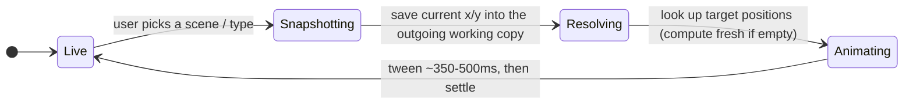

# The graph engine

The interactive family graph is the heart of the app. The **layout** is driven by a
[d3-force](https://d3js.org) simulation from
[`GraphCanvas.vue`](../src/renderer/src/components/GraphCanvas.vue) with pure helper
modules in [`components/graph/`](../src/renderer/src/components/graph/); the **drawing**
is done by a Three.js/WebGL renderer under
[`components/graph/webgl/`](../src/renderer/src/components/graph/webgl/).

> **Rendering note.** Earlier versions drew the graph as SVG. It now draws every node
> and link with instanced WebGL for scale, while d3-force still owns the simulation. The
> Vue ↔ simulation boundary below is unchanged; wherever this doc says "SVG"/"repaints
> paths", read it as the WebGL renderer being poked to redraw.

## Vue ↔ D3 boundary

Vue owns application state; D3 owns the SVG DOM and per-frame node positions. To keep
60fps drag/animation, `GraphCanvas` deliberately steps **outside** Vue reactivity for
the hot path:

- A plain (non-reactive) `ctx` object holds the D3 simulation, selections, the
  working `nodesData` / `linksData` arrays, timers, and per-mode snapshots.
- `watch`ers on `store.persons`, `store.relationships`, `store.theme`,
  `store.selectedPersonId`, and `store.graphSettings` re-sync the SVG when the store
  changes.
- Node objects are mutated in place (`n.x`, `n.y`, `n.fx`, `n.fy`) — the same object
  identity is reused across data updates so the simulation stays warm.

`ticked()` is the single render function: it repaints link paths and applies
`transform: translate(x,y)` to each node group on every simulation/animation frame.

## Layout types

Four layout **types**, picked from the bottom tool pill. A **scene** holds an
arrangement for *every* type at once (`scene.layouts[type]`), and `scene.type`
names the one on screen. Picking a different type stays in the same scene and
reveals that type's own arrangement — computed fresh the first time, restored
thereafter — so Free / Organic / Birth / Generations never clobber each other.
(The internal entry functions still use legacy mode ids, mapped from the scene
type.) Each type animates in with its own **signature motion** via the
[`useGraphAnimation`](../src/renderer/src/components/graph/useGraphAnimation.js)
composable: Free settles from the centre outward (bloom), Organic relaxes into
the force sim, Birth cascades top-down along the year axis, Generations snaps
into rows with a springy overshoot. Motion is a staggered, per-node tween
(`stagger` + `staggerBy` opts) so a layout resolves as a wave, not a jump.

| Type | Scene `type` | Behavior |
|------|--------------|----------|
| ✋ Free | `free` | Nodes are pinned (`fx`/`fy`); the user drags them freely and positions persist. |
| ⚡ Organic | `organic` | D3 force-directed layout (`forceLink`, `forceManyBody`, `forceCenter`, `forceCollide`). Dragging perturbs the simulation. |
| 📅 Birth | `birth` | Y position is fixed by birth date (older = higher); X is free to drag. Draws year guide lines and a "Present" line. See [`layoutAge.js`](../src/renderer/src/components/graph/layoutAge.js). |
| 🏛 Generations | `generations` | Hierarchical top-down layout computed from parent/child + spouse relationships. Nodes snap to generation rows; dragging between rows previews and creates new rows. See [`familyTreeLayout.ts`](../src/renderer/src/components/graph/familyTreeLayout.ts). |
| 🪐 Space | `space` | **Experimental (Labs).** The graph in 3D — see [Space (3D)](#space-3d) below. |

## Space (3D) {#space-3d}

The experimental fifth type turns the graph into a perspective 3D scene. It is
double-gated: the program mode must be **Advanced** AND the **🧪 Labs** toggle in
the topbar must be on (`caps.space3d` in the store — `caps.labs` shows the toggle
itself). With the gate off, a `space` scene degrades to Free over the same
positions, so nothing is ever lost.

- **Ownership split.** [`Graph3DView.vue`](../src/renderer/src/components/Graph3DView.vue)
  mounts over the (hidden) 2D canvases and takes over the stage AND the scene's
  working copy — GraphCanvas's snapshot machinery stands down while a space scene
  is active and calls `writeBack()` on the 3D view before any scene/type/project
  transition. Positions persist in the scene's normal `positions` map in the 2D
  convention (y-down) **plus `z`**, converted through a pivot
  ([`layout3D.js`](../src/renderer/src/components/graph/graph3d/layout3D.js) —
  pure and unit-tested in `tests/graph3dMath.test.js`); camera + toggles live in
  `config.space`. Switching types carries the arrangement both ways.
- **Simulation.** `d3-force-3d` (the n-dimensional generalization of d3-force)
  runs the same link/charge/center/collide recipe in the view component, exactly
  mirroring the 2D Organic setup.
- **Rendering.** [`Graph3DRenderer.js`](../src/renderer/src/components/graph/graph3d/Graph3DRenderer.js):
  instanced camera-facing avatar discs (same visual identity as 2D, plus depth
  fog, drawn back-to-front for correct translucency), instanced billboarded link
  ribbons with world-unit dashes and arrowheads, a deterministic starfield, and a
  projected-label overlay canvas. Frames are on-demand; idles at 0% CPU.
- **Controls.** Standard 3D-app conventions via Three's OrbitControls (left-drag
  orbit, right-drag pan, wheel dolly, inertial damping) plus node dragging in a
  camera-parallel plane, click select, double-click fly-to, `F` fit, `R`
  auto-rotate, `G` generation layers, `?` help. A hints card (auto-shown once,
  `space3dHintSeen` global setting) documents all of it.
- **Generation layers.** Toggling ≡ tweens every person onto a horizontal layer
  per generation (oldest on top, translucent discs + captions), then relaxes
  x/z with y pinned — the 3D cousin of the Generations type.

Layout math lives in **pure functions** (`computeAgeYPositions`, `computeGenLayout`)
that take data and dimensions and return target positions — no D3, no store, so they
are easy to reason about and test.

## Scenes

The graph runs off `view:'graph'` **Scenes** — named, saved arrangements the user
creates, renames, duplicates and deletes from the shared Scene tab strip
([`SceneTabs.vue`](../src/renderer/src/components/SceneTabs.vue)). A scene is a
single container that spans all layout types: `scene.layouts` maps each type to
its own `{ positions: { [personId]: {x, y} }, config }` (generation rows
`genRowYValues`/`genRowSpacing`, Focus `emphasis`), and `scene.type` is the type
currently shown. The flat `scene.positions`/`scene.config` mirror the active
type's arrangement (legacy readers, checkpoints, duplicates). `GraphCanvas`
keeps a live **working copy** — `sceneId → { [type]: {positions, config} }` — and
points the shared `ctx` at the active scene's active-type slot. **New scene**
(＋) is a clean slate (Organic, empty layouts → everything computes fresh);
**Duplicate** (⧉) deep-copies every type's layout.

Switching scene (or retyping the active one) is always the same guarded transition:

## Guides & generation rows

[`guideLines.js`](../src/renderer/src/components/graph/guideLines.js) draws the
non-node overlays in the `guides-layer`:

- **Birth type:** dashed horizontal year lines at a sensible interval, plus a
  highlighted **"Now · <year>"** line driven by `store.currentDate` that slides when
  the year changes.
- **Generations type:** dashed generation-row lines. Dragging a node shows a live
  "New Gen" preview; dropping resolves the target row (`resolveGenTarget`), and empty
  rows are pruned and redistributed with an animated reflow
  (`cleanupEmptyGenRows` / `redistributeGenRows`).

## Styling helpers

[`linkHelpers.js`](../src/renderer/src/components/graph/linkHelpers.js) contains pure
functions for node/link appearance — `nodeColor`, `linkPath` (a quadratic Bézier with
a deterministic per-edge bend so parallel links don't overlap), and the
emphasis-aware `getLinkStroke` / `getLinkWidth` / `getLinkMarker` / `getDashArray`.
Line style encodes type: solid = parent/child, dashed = spouse, dotted-ish = adopted;
divorced spouses are faded and finely dashed.

## Focus

The Focus popover (toggled from the tool pill) layers non-destructive emphasis over
any layout by adjusting node/link opacity, size, and color. These are visual filters
only — they never mutate data.

| Focus filter | Options |
|-----------|---------|
| Lineage | Default / Paternal / Maternal (traces father's vs mother's edges) |
| Gender | Default / Male / Female |
| Marriage | Default / Married / Divorced / Single |
| Deceased | Default / Deceased / Living — **requires** a Present date (Project ▾ menu) |

## Action wheel (edit modes)

Holding **Tab** over the canvas blooms a radial menu of eight directional slots under
the cursor ([`ActionWheel.vue`](../src/renderer/src/components/graph/ActionWheel.vue));
flick toward a slot and release to enter that **edit mode**. While a mode is live a
HUD chip names it at the bottom of the canvas and plain clicks route to its verb
instead of selecting (`handleModeClick` in `GraphCanvas.vue`); modifier gestures
(shift multi-select, ctrl trace) keep working. Esc or a quick Tab tap exits.

Mode kinds live in the pure catalog
[`wheelModes.js`](../src/renderer/src/components/graph/wheelModes.js): `add` (click
empty canvas → new person + inline name bubble), `delete` (click a node/bond, click
again within a beat to confirm — the target pulses red while armed), `link` (click
two people consecutively to create a relationship of the slot's type — a ghost
dashed line follows the cursor, and the second person becomes the next anchor so
chains flow), `tag` / `paint` (click people to toggle a tag / a node color), `pin`,
`end` (click a bond → sets `ended` to the current year) and `swap` (flip a directed
bond). Slots are user-configurable per project in
[`WheelConfigModal.vue`](../src/renderer/src/components/graph/WheelConfigModal.vue)
(press **C** while the wheel is open, the ⚙ on the HUD chip, or release onto an
empty slot); the layout persists as the `wheelSlots` setting via
`store.setWheelSlots`. Gating follows `caps` (family-band link types only in Simple
mode, tags/paint need Standard). The wheel component is generic — the timeline and
groups views can adopt it later with their own catalogs.

## Nodes

Each node is a circular avatar: the person's primary photo clipped to a circle, or a
Material "person" silhouette fallback. A name label (first name) sits below; an
optional age label fades in when *Show age* is enabled, computed against the current
date (or today) and capped at the death year.

## Persistence {#persistence}

Arrangements **autosave**: every position snapshot (drag end, retype, scene
operation) writes the active scene through `scenes:save`, lightly debounced and
flushed on scene/project switches and exit. On load, `GraphCanvas` enters the
project's saved active graph scene (the `activeSceneId:graph` setting), creating a
default `organic` scene for a brand-new project.

On top of autosave sits the manual **checkpoint**: **Save** (Ctrl/Cmd+S or the
Project ▾ menu) snapshots the project's arrangement state (scenes + Groups
placements + the Present override) via `checkpoint:save`, and **Revert to saved**
restores it wholesale via `checkpoint:revert`. Closing with changes since the last
checkpoint prompts *Save & Close / Discard & Close / Cancel* — wired from the main
process via `window.__hasUnsavedChanges` / `window.__saveCheckpoint` /
`window.__discardChanges` (see [`index.js`](../src/main/index.js) and
[`App.vue`](../src/renderer/src/App.vue)); the web build uses `beforeunload`.

## Other views on the same data

The graph is one of five views; the others also read the store's persons/relationships:

- **Directory** ([`PeopleView.vue`](../src/renderer/src/components/PeopleView.vue)) —
  searchable, sortable card grid. A native-scroll, responsive CSS grid that windows
  to the visible rows (pure math in [`people/peopleLayout.js`](../src/renderer/src/components/people/peopleLayout.js),
  scroll/resize glue in [`people/useVirtualGrid.js`](../src/renderer/src/components/people/useVirtualGrid.js),
  the card in [`people/PersonCard.vue`](../src/renderer/src/components/people/PersonCard.vue)).
  Only one transform (a `translateY` on the grid) moves per scroll frame — never per
  card. Wheel/trackpad and grab-and-drag ([`people/useDragScroll.js`](../src/renderer/src/components/people/useDragScroll.js))
  both navigate. Avatars render **downscaled thumbnails**, never the full-resolution
  photo: [`people/useThumbnail.js`](../src/renderer/src/components/people/useThumbnail.js)
  fetches the file's bytes (`images:bytes`), decodes them off-thread with
  `createImageBitmap` (Chromium handles WebP — the app's photo format — which
  `nativeImage` can't), paints a 144px cover-crop to a canvas, and caches the small
  data URL. Generation is idle-gated (`requestIdleCallback`) so it never competes
  with an active fling, and a skeleton shimmer shows until each resolves. Net effect:
  scrolling a large tree never decodes or GPU-uploads multi-megapixel images —
  measured at a steady 1440p scroll with zero dropped frames.
- **Relationships**
  ([`RelationshipsView.vue`](../src/renderer/src/components/RelationshipsView.vue)) —
  editable table with data-integrity issue detection.
- **Timeline**
  ([`TimelineView.vue`](../src/renderer/src/components/TimelineView.vue)) — vertical
  lifelines on a year axis, ordered into lanes by the family-tree layout algorithm
  (`computeTreeOrder`), with birth and
  marriage connectors and independent time/width zoom.
- **Groups**
  ([`FactionsView.vue`](../src/renderer/src/components/FactionsView.vue)) — people
  clustered by their **tags** (a Group = a tag placed in a groups scene via
  `scene_tags`) with a small d3-force simulation; members of several groups settle
  between them (tether threads, orbiting ring segments, and a count badge mark
  them). Membership edits the `entity_tags` join by drag-and-drop (from the stage,
  the unassigned tray, or the Directory tab). The Scene tab strip switches between
  **scenes** — alternative placements of the same shared tags; placements of the
  same tag glide between scenes while people shift with the simulation. Pure
  layout math lives in
  [`components/factions/factionLayout.js`](../src/renderer/src/components/factions/factionLayout.js).

The graph stays mounted (hidden) when another view is active, so its simulation and
layout state survive view switches.
