# TEMP · Client-side overhaul plan (for review)

> **Status: proposal, not implemented.** No code or other docs have been changed. Read,
> argue with, and edit this first. When you're happy, we fold the accepted parts into
> [`client-structure.md`](./client-structure.md) and implement in slices.
> Tags: 🟢 **Recommended** · 🟡 **Alternative** · ❓ **Your call**.

---

# 📌 Summary (read this first)

The whole plan in one screen. Details are in the numbered sections below.

### The big picture

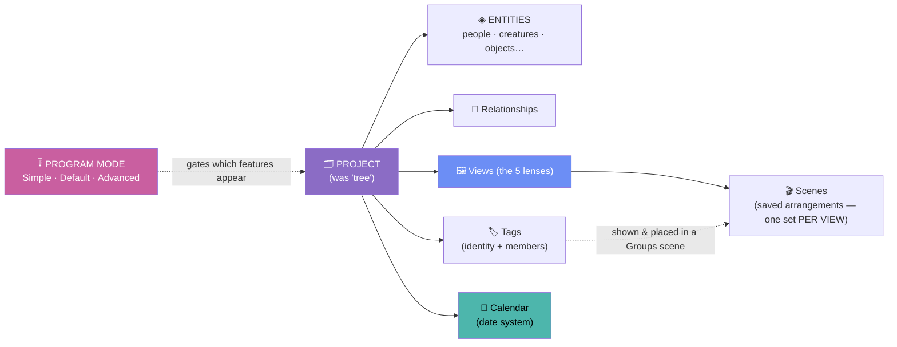

### Rename cheat-sheet

| Kind | Now | 🟢 New name |
|------|-----|-------------|
| Container / tab | Tree | **Project** |
| The node-link view | Tree View | **Graph** ✓ |
| The browse-grid view | All People | **Directory** ✓ |
| The clustering view | Factions | **Groups** ✓ |
| Table view | Relationships | **Relationships** ✓ |
| Timeline view | Timeline | **Timeline** ✓ |
| A group of members | Faction | **Tag** *(shown as a **Group** bubble)* |
| A saved arrangement | Scenario **and** State | **Scene** *(one word for both — see §4.0)* |
| Graph layout algorithm | mode (Custom/Auto/Age/Gen) | **type** → **Free · Organic · Birth · Generations** |
| App feature tier | *(none)* | **Mode** → **Simple · Standard · Advanced** ✓ |
| Emphasis panel | Highlights | **Focus** |
| Visual styling panel | Graph Settings | **Style** |
| Declutter toggle | Clean Tree | **Clean View** |
| "Now" reference | Current Date / "as-of year" | **Present** |
| Save button | Save Layout | *removed* → autosave + **Save**/**Revert** in Project menu |

### Four new concepts your feedback introduced

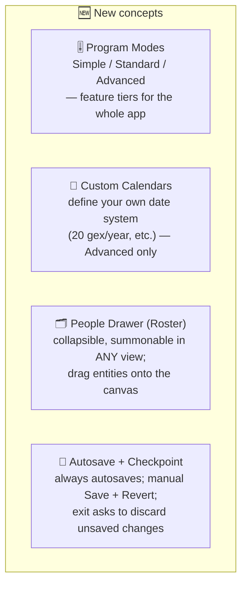

### The three orthogonal concepts that were tangled before

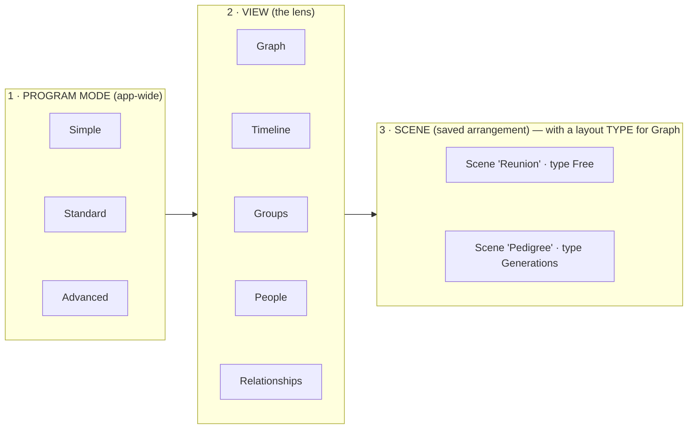

### What changed since the last draft (your feedback)
- ✅ Keep a **manual Save** + **Revert** + exit prompt (not autosave-only).
- ✅ "By Age" → **Birth**; "Present/Zen" → **Clean View**.
- ✅ New **Program Modes** (Simple/Standard/Advanced); tree "modes" → **types**.
- ✅ "Tree" view → **Graph** (it's a graph, not a tree).
- ✅ **Custom calendars** + rename the "now" marker to **Present**.
- ✅ Drag-and-drop works in **every** view via a **People Drawer**; scenes draw only *placed* entities.
- ✅ **Faction → Group** confirmed.
- ✅ "All People" → **dynamic entity noun** (entities aren't always people).

---
---

# Full detail

## 1. The naming overhaul

### 1.1 Why the old names hurt

Three *independent* things were sharing loose words:

- **"View"** meant a lens (Tree/Timeline/…) — fine.
- **"Mode"** meant a graph layout algorithm — but you now want "mode" for the *app-wide*
  Simple/Default/Advanced tiers.
- **A saved arrangement** was called a *state* in the graph but a *scenario* in factions —
  two words, one idea.

The fix gives each concept exactly one word (see the orthogonal diagram in the summary):

| Concept | 🟢 Word | Scope |
|---------|---------|-------|
| Feature tier | **Mode** | whole app (Simple/Default/Advanced) |
| Lens | **View** | Graph / Timeline / Groups / People / Relationships |
| Saved arrangement | **Scene** | inside a spatial view (was state + scenario) |
| Graph layout algorithm | **Type** | inside a Graph scene (Free/Organic/Birth/Generations) |

### 1.2 The Graph view (was "Tree")

You're right: a family tree with remarriage, adoption, and non-family links is a **graph**,
not a tree. ✅ **Decided: "Graph"** — honest, neutral, works for people/creatures/objects.
(The container is the *Project*; the picture is the *Graph*; the word "tree" retires from the
UI.)

### 1.3 The browse view (was "All People")

✅ **Decided: "Directory"** — one neutral word that covers people, creatures, objects, or
inventions without pretending they're all "people." It's the full-screen list; the compact
version of the *same* list is the right-dock **Directory tab** (§6.3).

🟡 **Optional (Advanced) follow-on — a per-project *entity noun*.** Independent of the view
name, an Advanced-mode setting can decide what a single node is *called* (Person / Character /
Creature / Invention) so buttons read "Add Character" etc. Default "Person". This is a *display*
label only — internally the data stays `persons`, not a data rename.

### 1.4 Graph layout **types** (was "modes")

| Now | Icon | 🟢 New | Why |
|-----|------|--------|-----|
| Custom | ✋ | **Free** | you place nodes anywhere |
| Auto | ⚡ | **Organic** | physics/force clustering |
| Age | 📅 | **Birth** | positioned by birth date (one word, per your note) |
| Gen | 🏛 | **Generations** | top-down family hierarchy |

Reads as: *Layout type: **Free · Organic · Birth · Generations***. 🟡 "Birth" alternatives:
*Era / Chronology / Lifespan*.

### 1.5 Panels & controls

| Now | 🟢 New | Why |
|-----|--------|-----|
| Highlights | **Focus** | non-destructive emphasis on a subset |
| Legend | **Legend** (keep, collapsible) | universal |
| Graph Settings | **Style** | purely visual styling |
| Clean Tree | **Clean View** | declutters the current view; "Clean Scene" would collide with Scene |
| Current Date / "as-of year" | **Present** | the date the app treats as "now" (see §5, works with custom calendars) |
| Save Layout | **Save** (in Project ▾) | see the save model in §4.3 |

---

## 2. The tag system

### 2.1 Person owns tags, or tags own persons? → **Neither. A join owns it.**

It's **many-to-many**; the moment one side owns the other, the reverse lookup gets slow and
the future Postgres migration gets painful. Store membership as its own join and build fast
lookups **both** ways in memory.

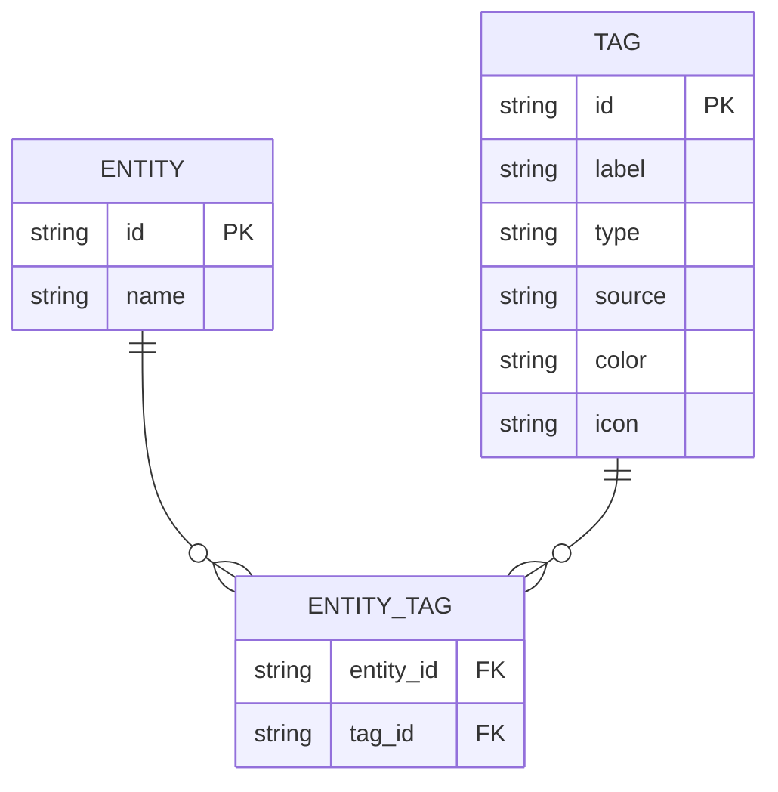

On load, build two `Map`s — `tagsOf[entityId]` and `membersOf[tagId]` — so *"what tags does
this node have?"* (node emblems, cards) and *"who's in this tag?"* (Groups view) are both O(1).

| Approach | tags-of-entity | members-of-tag | → Postgres | per-link data later |
|----------|:---:|:---:|:---:|:---:|
| array on entity | ✅ | ❌ scan all | ⚠️ | ❌ |
| array on tag *(today's factions)* | ❌ scan all | ✅ | ⚠️ | ❌ |
| 🟢 **join `entity_tags`** | ✅ | ✅ | ✅ 1:1 table | ✅ ("since", "canon"…) |

The join is the exact shape Supabase/Postgres wants (`entity_tags(entity_id, tag_id)` with an
index on each column) — **client model = future DB model**, no rewrite. See
[MID_DEVELOPMENT.md §5](./MID_DEVELOPMENT.md).

### 2.2 Two kinds of tags — one is free

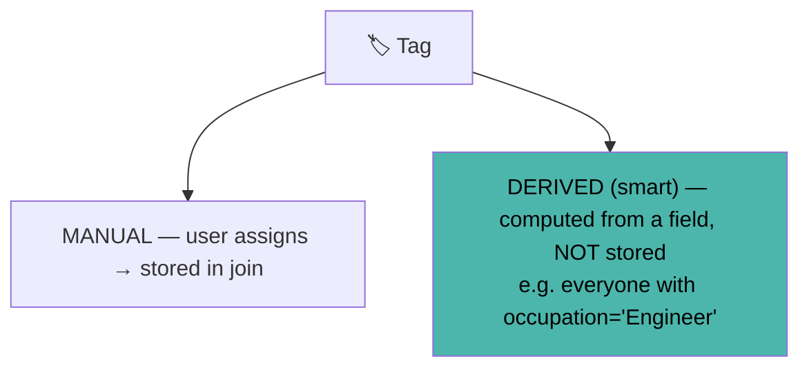

Occupation, location, birth date already live on each entity, so "common preexisting tags"
(location / occupation / decade / school) can be **derived** — zero storage, self-updating.
Manual tags (House Stark, Team Fire, Villains) use the join. A `tag.source` field splits them.
🟢 Ship **manual + join** first; derived tags as a fast follow (mostly a store getter).

### 2.3 A faction is just a tag with a place on screen

Split the two jobs a faction currently mashes together:

| Job | Today (Faction) | 🟢 New |
|-----|-----------------|--------|
| *who belongs* | `member_ids`, **copied per scenario** | **Tag** (one member set, shared everywhere) |
| *where it sits / shown* | `x`,`y`,`visible`,`scenario_id` | **Scene placement** (§3) |

---

## 3. Groups, Scenes & the faction/scenario question

### 3.1 The problem: factions are trapped in a scenario

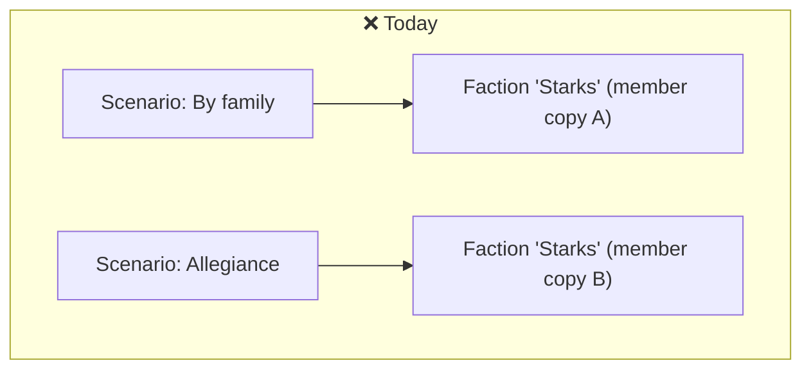

### 3.2 The fix: tags are global, scenes reference & place them

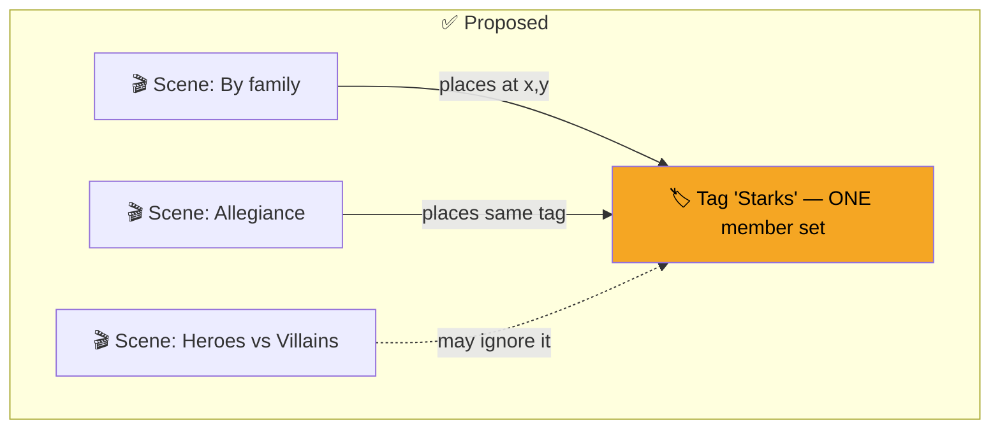

A **Group** is a tag placed in a scene. "Move a faction between scenarios" becomes trivial —
you add the tag to another scene; **membership never moves** because it lives on the tag.

### 3.3 Do factions & scenarios still exist?

| Concept | Verdict | Becomes |
|---------|---------|---------|
| **Faction** | dissolves | **Tag** + **scene placement**; UI word is **Group** |
| **Scenario** | survives, renamed | **Scene** — the same idea as a graph "state" (§4) |

Your instinct — *"scenarios are just different visualizations of combinations of tags"* — is
exactly what a Groups scene is: pick tags, arrange them, save as a Scene.

---

## 4. One unified **Scene** + the save model

### 4.0 Scene *is* State — and yes, scenes live inside each view

You're not confused — I under-explained it. **"Scene" is just the new name for "State."**
Nothing about the nesting changes: a scene belongs to **one view**, exactly like a state does
today. Each spatial view keeps its **own independent set of scenes**:

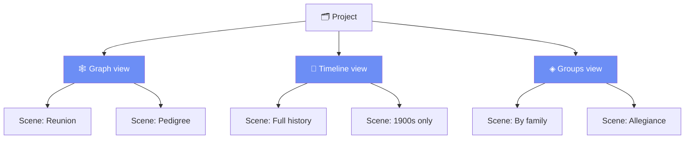

So all three of these are the *same kind of thing* — a saved state of one view — which is why
they get one name:

| View | Today's word | New word |
|------|--------------|----------|
| Graph | "state" | **Scene** |
| Timeline | *(none yet)* | **Scene** |
| Groups | "scenario" | **Scene** |

The only reason a scene carries a `view` field in the data model (§7) is **storage** —
everything is stored in one per-project collection and tagged with which view owns it. But
*logically and in the UI it lives inside its view*: the **Scene tab strip** at the bottom of
the canvas shows only the **current view's** scenes, and it swaps when you switch views. Switch
to Timeline → you see Timeline's scenes; switch to Groups → you see Groups' scenes. People and
Relationships have no positions, so they have no scenes.

### 4.1 State + Scenario + (future) timeline positions = **Scene**

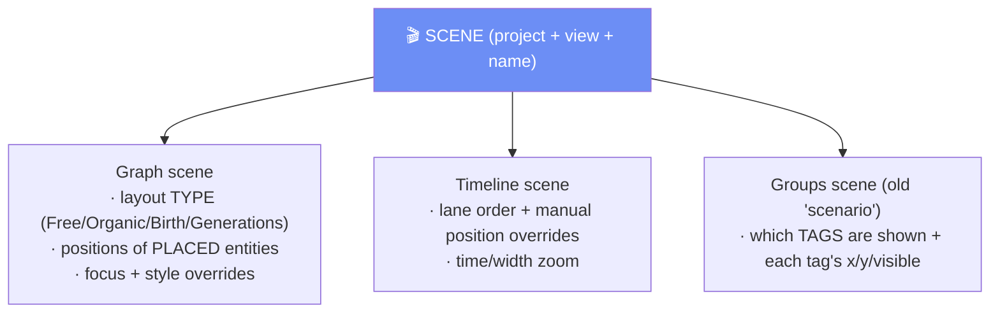

The graph "mode" becomes a **type** *inside* a scene, so instead of "4 modes × N states each"
you get a flat list of scenes, each with its own type:

```
BEFORE: Graph ─ mode(custom) ─ state1,2 ; mode(auto) ─ state1 ; …   (nested)
AFTER:  Graph ─ Scene "Reunion" (Free) ; Scene "Pedigree" (Generations) ; …   (flat)
```

### 4.2 Scenes draw only **placed** entities (fixes "everyone shows up")

You noted the Graph/Timeline showing *every* entity is wrong. 🟢 A scene stores positions for
the entities you've **placed**; unplaced entities aren't drawn. You add them by dragging from
the **People Drawer** (§6.3). Removing an entity from a scene never deletes it from the project.

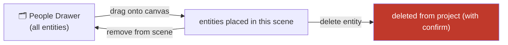

### 4.3 Save model — autosave **and** manual save (your requirement)

You want autosave *and* the ability to discard all unsaved changes. So we keep two layers,
like a document with autosave + explicit Save/Revert:

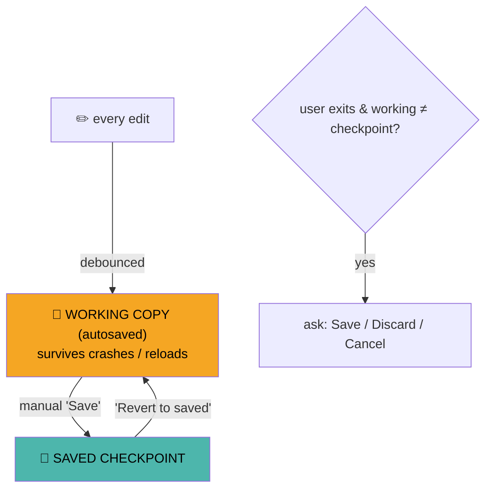

- **Autosave** → nothing is ever lost to a crash (writes to the working copy).
- **Save** (in **Project ▾** menu, ⌘S) → commits a checkpoint you can return to.
- **Revert to saved** → discards everything since the last Save.
- **On exit**, if the working copy differs from the checkpoint → *Save / Discard / Cancel*.
- The on-canvas **Save Layout** button and the pulsing dirty badge go away; the safety net moves
  into the menu + the exit prompt.

---

## 5. Custom calendars & the **Present**

### 5.1 Why

Real projects use Gregorian; fantasy projects may use wildly different systems ("20 months a
year, 100 days a month", extra cycles). Dates should also become **year-month-day**, not just a
year. So a project owns a **Calendar**, and every date is interpreted through it.

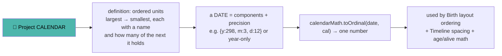

### 5.2 Two calendar kinds

| Kind | Definition | Math |
|------|-----------|------|
| 🟢 **Gregorian (default)** | real months + leap years | handled specially (accurate) |
| **Custom (Advanced mode)** | **uniform** nested units (each unit = fixed N of the next) | simple positional math |

**Fantasy example** — *year ▸ 20 gex ▸ 100 days*:
`ordinal = (year × 20 + gex) × 100 + day` → total order for free, so Birth-type layout and the
Timeline "just work" with no special cases.

### 5.3 Design rules

- Dates support **partial precision** (year-only, year+month, full) — birth years are often all
  you know.
- Layout math stays **pure**: `calendarMath.toOrdinal / fromOrdinal / format / duration` live
  beside `layoutAge`/`timelineLayout` (matches the codebase's pure-math principle — see
  [graph.md](./graph.md)).
- Store the **components** + precision (not a raw ordinal), so redefining a calendar doesn't
  corrupt data; the ordinal is derived on demand.
- Custom-calendar editing is **Advanced-mode only** (§7); Simple/Default use Gregorian.

### 5.4 The "Present"

The old "Current Date"/"as-of year" is renamed **Present** — *the date the app treats as "now"*
for age and living/deceased calculations. It's a full date in the project's calendar (defaults
to the latest date in the data). 🟡 Alternatives: *Now / Vantage*.

---

## 6. Program **Modes** + the UI overhaul

### 6.1 Program Modes: Simple / Default / Advanced

A whole-app feature tier so different users get the right amount of tool. **This "Mode" is
unrelated to the graph layout "types."**

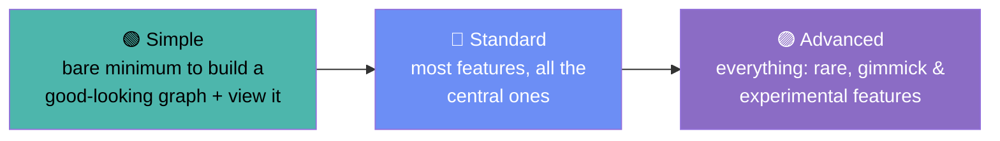

| Feature | Simple | Standard | Advanced |
|---------|:---:|:---:|:---:|
| Graph + People views | ✅ | ✅ | ✅ |
| Timeline / Groups / Relationships | — | ✅ | ✅ |
| Scenes (multiple saved arrangements) | 1 auto | ✅ | ✅ |
| Layout types | Organic only | all 4 | all 4 |
| Focus / Style panels | — | basic | full + physics sliders |
| Tags | — | manual | manual + derived + smart realign |
| Custom calendars | — | — | ✅ |
| Custom entity noun / relationship types | — | — | ✅ |

Implementation is just **progressive disclosure**: a higher mode reveals more rail items,
pill tools, and popovers — no separate UIs.

### 6.2 Layout: icon rail + one tool pill + contextual inspector + summonable roster

**Today** (cluttered): 4+ floating panels on the canvas; the right sidebar permanently holds
the whole people list; settings live in 3 places.

**Proposed** — three fixed zones: a slim **icon rail** (left), the **canvas** (center), and a
tabbed **right dock**. The right dock has two tabs — **Inspector** and **Directory** — so the
draggable roster lives on the right next to the details panel (your choice):

```
┌──────────────────────────────────────────────────────────────────────┐
│ ≡  Project ▾   Scene: Reunion ▾      🔍 ⌘K     Mode: Standard ▾    ⚙  │ top bar
├───┬─────────────────────────────────────────────┬────────────────────┤
│🕸 │                                             │  RIGHT DOCK        │
│👥 │                                             │ ┌────────┬────────┐ │
│🔗 │              ACTIVE VIEW (canvas)            │ │Inspector│Directory│ │  ← tabs
│📅 │                                             │ ├────────┴────────┤ │
│◈  │                                             │ │ Inspector:      │ │
│   │       ╭──── bottom tool pill ────╮           │ │  clicked entity │ │
│＋ │       │ Type▾  ⊕ − ⊡  Focus▾  Legend │       │ │  details+tags   │ │
│⚙  │       ╰────────────────────────────╯         │ │ Directory:      │ │
│   │                                             │ │  full list —    │ │
│   ├─────────────────────────────────────────────┤ │  drag → canvas  │ │
│   │ Scene tabs (this view): ▸Reunion ▸Big pic + │ └─────────────────┘ │
└───┴─────────────────────────────────────────────┴────────────────────┘
  icon rail (~56px): 🕸Graph · 👥Directory · 🔗Relationships · 📅Timeline · ◈Groups · ＋add · ⚙settings
```

Three fixed zones, nothing floating except the one bottom pill:

| Zone | Holds |
|------|-------|
| **Icon rail** (left, ~56px) | the 5 views + ＋add + ⚙settings; always visible |
| **Canvas** (center) | the active view + one **bottom tool pill** + the **Scene tab strip** (this view's scenes) |
| **Right dock** (tabbed, collapsible) | **Inspector** tab (what you clicked) · **Directory** tab (the draggable roster) |

| Element | From | 🟢 To |
|---------|------|------|
| View switching | left sidebar list | **icon rail** (always visible, tiny) |
| Canvas tools | 3 separate bars | **one bottom pill** (Type + zoom + Focus popover + Legend toggle) |
| Focus / Legend | always-open panels | **on-demand** popover / toggle |
| Scene switching | tree "states bar" + factions "scenario bar" | **one Scene tab strip** (spatial views) |
| Stats + data actions (Export/Import/**Save**/**Revert**) | left sidebar | **Project ▾** menu |
| Settings (theme + Style + Program Mode + Calendar) | 3 places | **one ⚙ Settings** (tabbed) + quick theme + Mode picker in top bar |
| Jump to any entity | per-view search boxes | **⌘K palette** (+ keep per-view filter) |

### 6.3 The right panel + the drag-and-drop problem

You want drag-and-drop of entities in **every** view (Graph, Timeline, Relationships, Groups),
*and* you don't want every entity auto-present. So the right dock does **two jobs via two
tabs** — both on the right, as you chose:

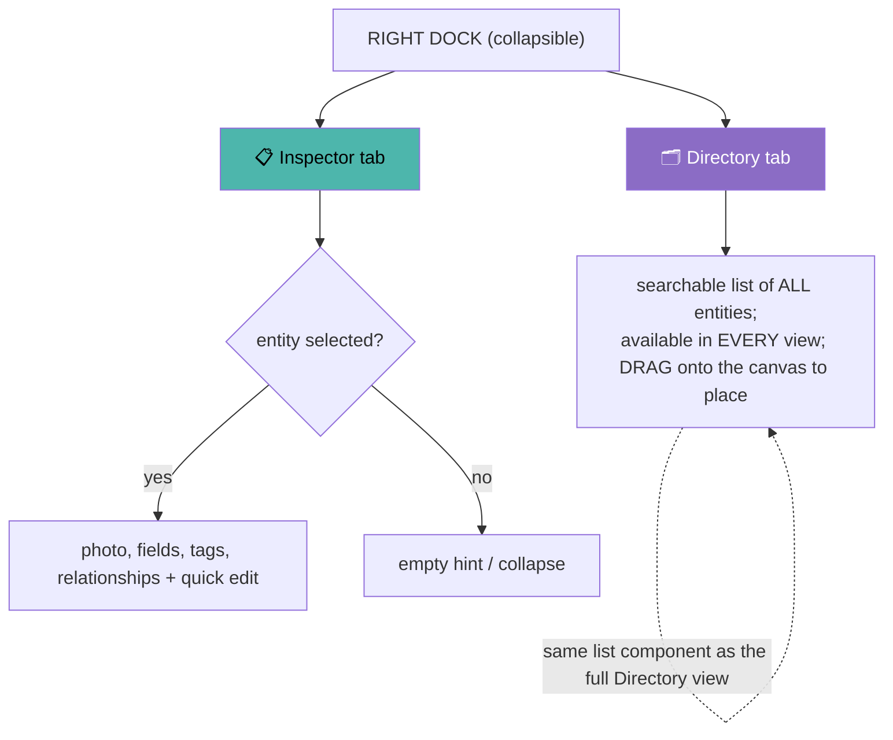

- **Inspector tab** — tells you about what you clicked; stops permanently duplicating the
  Directory view (which is why the old always-on people list goes away).
- **Directory tab** — the draggable roster, reachable in *every* view. Drag an entity onto the
  Graph/Timeline/Groups canvas (or into the Relationships table) to place/relate it. It auto-
  focuses this tab when you start a drag or click empty canvas, and can switch back to Inspector
  on selection.
- It's the **same list component** as the full-screen **Directory view** — one implementation,
  two surfaces (full browse vs. compact drag-source).

This gives drag-to-place everywhere, keeps the canvas maximal (the dock collapses), and matches
the "placed entities only" scene model (§4.2). Collapsing beats a permanent sidebar on
mobile/PWA too.

### 6.4 Colors

🔴 **Fix a real collision:** female = pink **and** spouse-link = pink means color encodes two
things. Give relationships their own hue family so color never double-means:

| Encodes | Channel | 🟢 Proposed |
|---------|---------|-------------|
| Gender | node fill | male indigo-blue · female magenta · unknown slate |
| Relationship | **line style + separate hues** | parent/child solid violet · spouse **gold** (not pink) · adopted dashed amber · divorced faded gold |
| Tag / Group | user-chosen per tag | unchanged |

🟢 **Direction (clean / cool / modern / simplistic):** one accent (keep indigo `--accent`),
lots of neutral grays, hairline borders, generous whitespace; color only where it *means*
something. **Polish light mode** as its own warm-neutral palette (not an inversion). The panel
consolidation in §6.2 already removes most on-canvas color noise.

---

## 7. Proposed data model

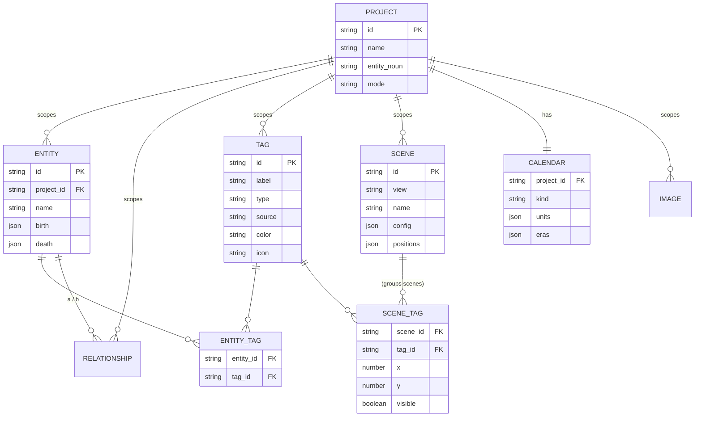

**Migration from today (all mechanical, covered by the Vitest data-layer suite):**

| Today | New | How |
|-------|-----|-----|
| `trees` | `projects` (+`entity_noun`, `mode`, `calendar`) | rename; `tree_id`→`project_id` |
| `factions{member_ids, scenario_id, x,y,visible}` | `tags` + `entity_tags` + `scene_tags` | dedupe factions by name → tags; members → join; one `scene_tag` row per scenario placement |
| `scenarios` | `scenes` (view='groups') | rename; add `view`,`config`,`positions` |
| tree `graphState` blob | `scenes` (view='graph') | unpack modes/states into scene rows; mode → `config.type` |
| `birth_year` / `death_year` (number) | `birth` / `death` (date value + precision) | wrap the year as `{y, precision:'year'}` |

Storage notes: keep the object-map style client-side; `entity_tags`/`scene_tags` are small join
collections with two-way index Maps built at load. In Postgres later these are literal tables
with composite PKs; `config`/`positions`/`units` stay `jsonb`. Derived tags are never stored.

---

## 8. Decisions (locked ✅)

| # | Question | Decision |
|---|----------|----------|
| 1 | Graph view name | **Graph** |
| 2 | Browse view name | **Directory** (per-project entity noun optional, Advanced) |
| 3 | Age layout type name | **Birth** (revisit later) |
| 4 | The "now" marker | **Present** |
| 5 | Program Mode tiers | **Simple / Standard / Advanced** |
| 6 | Relationships view name | **Relationships** (keep) |
| 7 | Spouse link color | **Gold** (off pink) |
| 8 | People roster placement | **Right dock**, as a tab beside Inspector |

Still genuinely open (not blocking): whether to **flatten layout "type" into the Scene** (§4.1,
recommended) vs. keep it as a grouping level; and the exact **custom-calendar editor** UX (§5).

---

## 9. Suggested rollout order (each step shippable, low-risk)

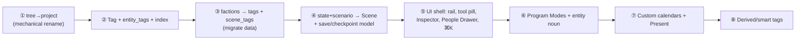

①–④ are data/logic (Vitest-coverable — see [developer.md](./developer.md#testing)); ⑤ is
presentation; ⑥–⑧ are additive. Custom calendars (⑦) come late because they touch every date
field — do them once the structure is settled.

---

### Once approved
Fold the accepted decisions into [`client-structure.md`](./client-structure.md), update
[`data-model.md`](./data-model.md) + [`graph.md`](./graph.md) to match, and delete this temp file.
